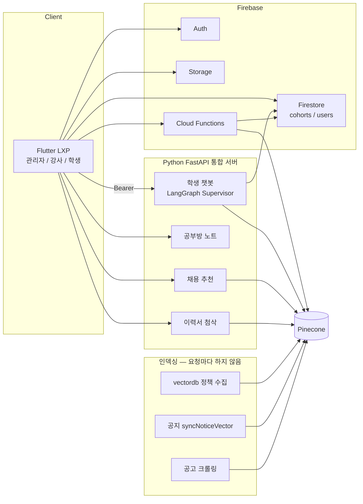
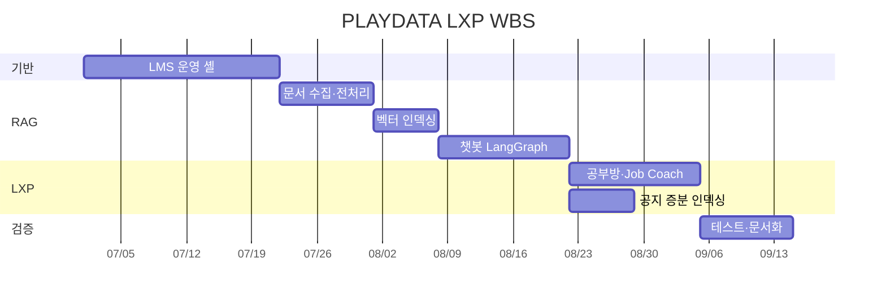
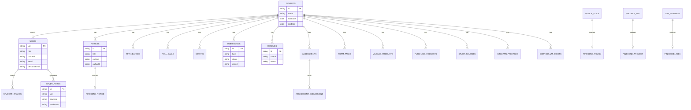

# SK네트웍스 Family AI 캠프 34기 3차 프로젝트

# PLAYDATA LXP

> 플레이데이터 부트캠프 **LMS를 LXP(Learning Experience Platform)로 전환**한 프로젝트.  
> 기수 운영(출결·승인·CMS)은 유지하고, 학습자 경험은 **내외부 문서 RAG + 개인화 AI**로 확장한다.

[](https://flutter.dev)
[](https://firebase.google.com)
[](https://github.com/langchain-ai/langgraph)
[](https://www.pinecone.io)

| 항목 | 내용 |
| --- | --- |
| 과정 | SK네트웍스 Family AI 캠프 34기 |
| 차수 | 3차 프로젝트 |
| 팀 | 2팀 |
| 저장소 | [SKNETWORKS-FAMILY-AICAMP/SKN34-3rd-2Team](https://github.com/SKNETWORKS-FAMILY-AICAMP/SKN34-3rd-2Team) |
| 작업 브랜치 | `develop` (`main`은 배포용) |

---

## 목차

1. [팀 소개](#1-팀-소개)
2. [프로젝트 개요](#2-프로젝트-개요)
3. [기술 스택](#3-기술-스택)
4. [WBS](#4-wbs)
5. [요구사항 명세서](#5-요구사항-명세서)
6. [ERD](#6-erd)
7. [주요 기능 소개](#7-주요-기능-소개)
8. [수행 결과](#8-수행-결과)
9. [한 줄 회고](#9-한-줄-회고)

- [시스템 아키텍처](#시스템-아키텍처)
- [데이터 수집 및 전처리](#데이터-수집-및-전처리)
- [RAG 질의응답 파이프라인](#rag-질의응답-파이프라인)
- [테스트 시나리오](#테스트-시나리오)
- [트러블슈팅](#트러블슈팅)
- [역할 분담 & 협업](#역할-분담--협업)
- [향후 개선 계획](#향후-개선-계획)
- [실행 방법](#실행-방법)

---

## 1. 팀 소개

### 팀명

**SKN34 2팀 — PLAYDATA LXP**

### 멤버 (개인 GitHub)

| 이름 | GitHub |
| --- | --- |
| 김기호 | [kyo-135](https://github.com/kyo-135) |
| 김대호 | [jjhok6389](https://github.com/jjhok6389) |
| 문성호 | [MoonSungHo](https://github.com/MoonSungHo) |
| 최성욱 | [Overlay1010](https://github.com/Overlay1010) |

담당 영역은 [역할 분담](#역할-분담--협업)을 본다.

---

## 2. 프로젝트 개요

### 프로젝트 명

**PLAYDATA LXP** — PLAYDATA All-in-One LMS를 학습 경험 플랫폼으로 확장

### 프로젝트 소개

기존 부트캠프 LMS는 관리자·강사 중심의 **운영 시스템**이다. 출결, 좌석, 제출 승인, 공지, 마일리지, 평가를 기수(`cohort`) 단위로 닫아 관리한다.

이 프로젝트는 그 위에 LXP를 얹는다. 학생은 같은 셸에서

- 정책·공지·프로젝트 레퍼런스를 **RAG로 질문**하고
- 수업 GitHub에서 **AI 학습 노트**를 만들고
- 이력서로 **채용공고 추천·첨삭**을 받고
- 커리큘럼 기반 **주간 학습 추천**을 본다

운영 데이터(Firestore)와 문서 벡터(Pinecone)를 한 질의에서 같이 쓰므로, “규정이 뭐냐”와 “내 출석률이 얼마냐”를 같은 챗봇이 답한다.

### 프로젝트 필요성 (배경)

| 기존 LMS의 한계 | LXP로 바꾸는 이유 |
| --- | --- |
| 출결·공지·제출·이력서·평가가 폼·채널·시트로 흩어짐 | 역할별 셸 + 기수 격리로 운영을 한곳에 모은다 |
| 규정·FAQ는 노션에 있고 학생은 매번 찾아 헤맴 | 내외부 문서를 임베딩해 RAG로 질의한다 |
| 챗봇이 일반 LLM이면 규정을 지어냄 | 검색된 청크 + Firebase 실데이터만 근거로 답한다 |
| 수업 자료·취업 준비는 LMS 밖 작업 | 공부방·Job Coach를 학습 경험으로 붙인다 |

3차 과제 주제는 **LLM을 연동한 내외부 문서 기반 질의응답**이다. 우리 팀은 이를 데모용 챗봇이 아니라, 실제 부트캠프 운영 LMS 안의 LXP 기능으로 구현했다.

### 프로젝트 목표

- 환각을 줄이기 위해 **검색된 내외부 문서 + 로그인 학생의 Firestore 데이터** 안에서만 답하게 한다
- 정책·FAQ·공지·프로젝트 레퍼런스·채용공고를 **청킹·임베딩 후 Pinecone에 저장·검색**한다
- **LangChain / LangGraph**로 벡터 DB와 LLM을 연동하고, Supervisor가 namespace·scope를 고른 뒤 명시적 신호로 보정한다
- 인덱싱(수집·청킹·임베딩·적재)과 런타임(검색·생성)을 분리한다. 질문마다 문서를 다시 임베딩하지 않는다
- LMS 운영 기능(계정·출결·승인·평가)은 유지한 채, 학생 경험을 LXP로 전환한다

---

## 3. 기술 스택

| 구분 | 기술 |
| --- | --- |
| Frontend | Flutter 3.12+, Dart, Material 3, Riverpod 3, go_router 18 |
| Backend | Firebase Auth, Firestore, Storage, Cloud Functions Gen2 (`asia-northeast3`) |
| AI / RAG | Python 3.12, FastAPI, LangGraph, LangChain, OpenAI (`gpt` + `text-embedding-3-small`) |
| Vector DB | Pinecone (namespace: `policy`, `notice`, `project_reference`, 채용공고) |
| 수집·전처리 | Notion / PDF / CSV / MD / XLSX, GitHub 수업 repo, 채용공고 크롤링 |
| 연동 | Google Forms webhook, Discord 공지 동기화, Inflearn 패키지, YouTube 추천 |
| 테스트 | Flutter `flutter_test`, 모듈별 pytest |

---

## 시스템 아키텍처

인덱싱은 배치·트리거로 한 번 하고, 서비스 요청은 **검색 + 생성**만 한다.



런타임 질의 흐름:

```
사용자 질문
   → Supervisor 분류 (lms / greeting / blocked)
   → 명시적 신호로 namespace·scope 보정 (결정론적 라우팅)
   → 질문 임베딩
   → Pinecone 검색 (policy / notice / project_reference)
   → 프로젝트는 기수 범위 버킷 검색 후 기수별 다양화
   → 필요 시 Firestore 학생·기수 스코프 조회
   → 진행 중 단위기간이면 출석 예상치 보강
   → Context 구성 (관련 청크만)
   → LLM 스트리밍 답변
```

주요 경로:

| 역할 | 경로 |
| --- | --- |
| 정책 수집·청킹·적재 | `vectordb/policy_ingestion.py` |
| 학생 RAG 챗봇 | `chatbot/student_chatbot.py` |
| 결정론적 라우팅 보정 | `chatbot/student_chatbot.py` `detect_routing_signals` |
| 진행 중 출석 보강 | `chatbot/attendance.py` |
| 프로젝트 기수 범위 검색 | `chatbot/project_search.py` |
| 학생 Firestore 문맥 | `chatbot/firebase_student_context.py` |
| 공지 증분 인덱싱 | `functions/src/noticeVectors.ts` |
| 공부방 노트 | `study_notes/` |
| 채용 추천 | `job_matching_bot/` |
| 이력서 첨삭 | `cover_letter_rag/` |
| LMS CRUD | `lib/shared/data/lms_repository.dart` |

---

## 4. WBS

| 단계 | 작업 | 산출 |
| --- | --- | --- |
| 1. LMS 기반 | 역할별 셸, 기수 격리, 계정·출결·좌석·승인·게시판·마일리지·평가 | Flutter 앱, Firestore 규칙 |
| 2. 데이터 수집 | 정책 Notion/PDF/CSV/MD, FAQ, 프로젝트 레퍼런스 CSV, 채용공고 | `vectordb/data/` |
| 3. 전처리·인덱싱 | 정제, 고유 ID, 메타데이터, 청킹(500/overlap 40), 임베딩, Pinecone 적재 | `policy_chunks.jsonl`, 인덱스 |
| 4. RAG 연동 | LangGraph Supervisor, 결정론적 라우팅 보정, namespace 검색, Firebase 스코프, 프롬프트 | `chatbot/` |
| 5. LXP 학습 경험 | 공부방 노트, Job Coach, YouTube 추천, 미션·마일리지 | `study_notes/`, `job_matching_bot/`, `cover_letter_rag/` |
| 6. 운영 연동 | 공지 작성 시 벡터 동기화, Discord 공지, Google Form 출결/설문 | Cloud Functions |
| 7. 검증 | 단위 테스트, RAG 질의 시나리오, 환각·권한·속도 점검 | `test/`, 모듈 pytest |
| 8. 문서 | README, SETUP, 아키텍처, 전처리·테스트 기록 | 본 문서, `SETUP.md` |



---

## 5. 요구사항 명세서

### 5-1. 과제 필수 (LLM / RAG)

| ID | 요구사항 | 구현 |
| --- | --- | --- |
| RAG-01 | 내외부 문서 수집 및 가공 | `vectordb/` Notion·PDF·CSV·MD·XLSX, 공고 크롤링 |
| RAG-02 | 문서를 벡터로 임베딩해 Vector DB에 저장·검색 | Pinecone, `text-embedding-3-small`, 1536차원 |
| RAG-03 | LangChain으로 Vector DB와 LLM 연동 | LangGraph Supervisor + 결정론적 라우팅 가드레일 + ChatOpenAI |
| RAG-04 | 환각 방지 — 검색된 데이터 안에서만 답변 | 근거 청크 제한, 프롬프트 인젝션 방어, 차단 토픽 |
| RAG-05 | One-shot / Few-shot 프롬프트 | Supervisor·노트·추천 프롬프트 템플릿 |
| RAG-06 | 인덱싱과 런타임 분리 | 질문마다 `from_documents()` 재적재 금지 |
| RAG-07 | 문서 변경 시 증분 인덱싱 | 정책 state 파일, 공지 `syncNoticeVector` |

### 5-2. LXP (학습 경험)

| ID | 요구사항 | 역할 |
| --- | --- | --- |
| LXP-01 | 정책·공지·프로젝트 레퍼런스 질의 | 학생 챗봇 FAB, 기수 범위 검색 |
| LXP-02 | 본인 출결·마일리지·이력 등 실데이터 조회 | Firebase student scopes, 진행 중 출석 예상치 |
| LXP-03 | GitHub 수업 자료 → Markdown 노트 + 복습 문제 | 공부방 |
| LXP-04 | 이력서 기반 채용공고 추천·첨삭 | Job Coach |
| LXP-05 | 커리큘럼 기반 주간 YouTube 추천 | 대시보드·학습실 |

### 5-3. LMS 운영 (LXP의 기반)

| ID | 요구사항 | 역할 |
| --- | --- | --- |
| LMS-01 | 폐쇄형 계정, 역할별 홈, 온보딩 | 전체 |
| LMS-02 | 기수 CRUD, 학생·강사 계정, 퇴소/복학 | 관리자 |
| LMS-03 | 출석·자리 확인·좌석 배치 Publish | 관리자 / 강사 |
| LMS-04 | 기록실·이력서·마일리지 구매 승인 | 관리자 |
| LMS-05 | AI 문항 생성, 평가 게시·채점 | 강사 |
| LMS-06 | 이력서 11섹션, 기록 5유형, 평가 응시 | 학생 |

---

## 6. ERD

Firestore는 RDB가 아니므로 **기수 루트 아래 서브컬렉션**으로 모델링한다. 벡터 문서는 Pinecone에 두고, 공지 원문은 Firestore에 남긴 뒤 Functions가 인덱스를 맞춘다.



경로 상수는 `lib/core/constants/firestore_paths.dart`.

---

## 7. 주요 기능 소개

LMS → LXP 전환의 축은 **운영은 역할별로, 학습 경험은 AI로** 나눈 것이다.

### 7-1. 역할별 홈

| 역할 | 홈 | 내비 |
| --- | --- | --- |
| 관리자 | `/admin` | 대시보드, 운영·인원, 출결·공간, 학습·평가, 소통·리워드, LLMOps |
| 강사 | `/instructor` | 자리 확인, 이력서관리, 게시물관리, 성취도평가, 커리큘럼, 마이페이지 |
| 학생 | `/` | 대시보드, 이력서 관리, 학습실, 게시판, 자리 배치, 설문·제출, 자격 시험 일정, 기록실, 마일리지, 성취도평가 + 챗봇 FAB |

### 7-2. 관리자 — 기수를 설계하고 승인한다

- 기수 CRUD, 전역 기수 컨텍스트
- 학생·강사 계정 생성 (`@playdata.co.kr` 임시 비밀번호), 퇴소/복학
- 출석 수정, 좌석 배치 Publish, 자리 확인
- 기록실 5유형 승인 시 마일리지 자동 정산
- 게시판: 공지 / 예약 공지 / 알림 팝업, Discord 동기화
- 공지 저장 시 Pinecone `notice` 증분 인덱싱
- LLMOps: 생성 로그, outcome 피드백, 학생 챗봇 메타(route/version/latency), evalRuns, 문항 채택률

### 7-3. 강사 — 현장에서 출결하고 평가한다

- 교시별 좌석맵 출석 (`rollCalls`)
- 이력서 섹션 피드백 (학생 원문 직접 저장 불가)
- 커리큘럼 CSV → 평가 AI·YouTube 추천 소스
- 성취도평가: MC/SA, 커리큘럼 구간 기반 AI 문항 생성, 정답 클라이언트 미노출

### 7-4. 학생 — 학습·이력·보상을 한곳에서 한다

- 대시보드: 공지, 출석 캘린더, 미션, 좌석, 승인 현황
- 이력서 11섹션, PDF, 피드백 요청
- 기록실 제출 → 관리자 승인 → 마일리지
- 학습실 Inflearn + 공부방 AI 노트
- 챗봇: 출결·공가·장려금·공지·프로젝트 레퍼런스·정책

### 7-5. LXP AI (핵심 차별점)

**학생 챗봇 (RAG)**  
LangGraph Supervisor가 `policy` / `notice` / `project_reference`와 Firebase 스코프를 고른 뒤, 질문에 드러난 공지·정책·출석·프로젝트 신호를 합집합으로 보정한다. 대필·무관 주제는 `blocked`. NDJSON 스트리밍, Bearer 인증, 프롬프트 인젝션 가드. 완료된 단위기간은 출석률을 계산하고, 진행 중이면 확인된 수업일 기준 예상치(`in_progress_estimate`)만 안내한다. 프로젝트 범위 질문(예: 1~28기)은 기수 버킷 검색 후 서로 다른 기수 사례를 우선한다. `/stream` 1회는 `aiGenerationLogs`(type=`student_chatbot`) 1건이며 route·promptVersion·latency만 남기고 질문·답변 원문은 저장하지 않는다. 도움됨/안됨은 `aiQuestionFeedback`으로 집계하고, `chatbot_lab.evaluate_supervisor --publish`가 `aiEvalRuns`에 평가 요약을 남긴다.

**공부방**  
관리자가 등록한 GitHub 수업 repo에서 날짜/폴더/파일(최대 8)을 고르면, 단일 LLM 패스로 Markdown 노트 + 복습 문제 6개를 만든다. 생성 락 10분. 결과는 `users/{uid}/studyNotes`.

**AI Job Coach**  
이력서로 공고를 검색·하드필터·재정렬하고, 인용 근거가 원문에 있을 때만 남긴다. 공고 맞춤 첨삭은 `cover_letter_rag`가 담당한다.

---

## 8. 수행 결과

### 8-1. 실행 · 시연

로컬 실행은 [SETUP.md](SETUP.md). 웹 시연은 Chrome.

```powershell
git clone https://github.com/SKNETWORKS-FAMILY-AICAMP/SKN34-3rd-2Team.git
cd SKN34-3rd-2Team
git checkout develop
flutter pub get
flutter run -d chrome
```

AI 기능(챗봇·공부방·추천·첨삭)은 루트 `.env`와 FastAPI 통합 서버가 필요하다.

```powershell
py -3.12 -m venv playdata_venv
playdata_venv\Scripts\activate
pip install -r requirements.txt
python -m uvicorn app.integrated:app --app-dir cover_letter_rag --port 8000
```

### 8-2. 시연 동선 (발표용)

1. 관리자 로그인 → 기수 선택 → 공지 작성 → 학생 챗봇이 새 공지를 찾는지 확인
2. 강사 로그인 → 자리 확인 → 성취도평가 AI 문항 생성
3. 학생 로그인 → 대시보드 → 챗봇에 공가/출석률 질문 → 공부방 노트 생성 → 이력서 Job Coach

### 8-3. 테스트

| 구분 | 위치 | 내용 |
| --- | --- | --- |
| Flutter 단위/위젯 | `test/` | 온보딩, 챗봇 UI, 이력서 권한, Job Coach 클라이언트, 알림 팝업 |
| 추천·첨삭 | `job_matching_bot/`, `cover_letter_rag/` | 검색·필터·인용 검증, 첨삭 품질 비교 문서 |
| RAG 운영 원칙 | 본 문서 테스트 시나리오 | 정책 질의, 개인 출석, 차단 토픽, 공지 증분, 프로젝트 범위 검색 |

```powershell
flutter test
```

### 8-4. 화면 캡처

시연 후 아래 칸에 캡처를 넣는다.

| 화면 | 캡처 |
| --- | --- |
| 로그인 · 역할별 홈 | *(첨부)* |
| 학생 챗봇 RAG 답변 | *(첨부)* |
| 공부방 노트 | *(첨부)* |
| 이력서 + Job Coach | *(첨부)* |
| 관리자 승인 허브 | *(첨부)* |
| 강사 성취도평가 AI | *(첨부)* |

발표 슬라이드: `presentation/PLAYDATA_LMS_발표자료.pptx`

### 8-5. 과제 필수 산출물 위치

| 산출물 | 위치 |
| --- | --- |
| 수집 데이터 · 전처리 | `vectordb/data/`, `vectordb/policy_ingestion.py` |
| 시스템 아키텍처 | 본 README |
| RAG + Vector DB 연동 코드 | `chatbot/`, `vectordb/`, `functions/src/noticeVectors.ts` |
| 테스트 계획·결과 | [테스트 시나리오](#테스트-시나리오), `test/`, `cover_letter_rag/docs/` |

---

## 9. 한 줄 회고

LMS를 잘 만드는 것과 LXP로 바꾸는 것은 다르다. 운영 화면을 모으는 데 그치지 않고, **문서와 내 데이터를 같은 질문에서 검색하게 만든 뒤** 학습 노트와 취업 코치까지 한 셸에 넣었을 때 비로소 학습 경험이 된다.

---

## 데이터 수집 및 전처리

### 수집 소스

| 소스 | 유형 | 위치 |
| --- | --- | --- |
| 플레이데이터 Notion 정책·FAQ | 외부 문서 | `vectordb/policy_ingestion.py` `NOTION_URLS` |
| 마일리지·회고·환급·프로그래머스 매뉴얼 | MD / CSV | `vectordb/data/policy_md/`, `policy_csv/` |
| 전 기수 프로젝트 레퍼런스 | CSV | `vectordb/data/project_reference/` |
| 기수 공지 | Firestore | 작성 시 Functions가 임베딩 |
| 채용공고 | 크롤링 | `job_matching_bot/crawling/` |
| 수업 코드 | GitHub | 관리자 Study Source → 공부방 (벡터 적재가 아니라 생성 시 파일 로드) |

정책 카테고리 예: 출결, 공가, 마일리지, 훈련장려금, FAQ, 프로젝트, 수료·제적 등 18종.

### 전처리

1. HTML·중복·무의미 짧은 텍스트 제거, 유니코드 정규화
2. 문서마다 고유 키(`source.key`) + chunk SHA-256 ID
3. Document 메타데이터: `id`, `source`, 정책 타입, 날짜 등 필터 필드
4. 청킹: 기본 **500자 / overlap 40**. FAQ는 Q-A 블록을 먼저 나눈 뒤 분할
5. 임베딩은 인덱싱 시에만 생성. 모델이 바뀌면 재인덱싱
6. Pinecone에 벡터 + 원문 chunk + metadata + document ID 저장
7. 정책은 `.policy_ingestion_state.json`으로 증분을 돕고, 공지는 문서 변경 트리거만 반영

```powershell
python -m vectordb.policy_ingestion ingest
```

---

## RAG 질의응답 파이프라인

### 모델 · 프롬프트

- LLM: OpenAI Chat (LangChain `ChatOpenAI`)
- Embedding: `text-embedding-3-small`
- Supervisor 프롬프트는 질문을 `lms` / `greeting` / `blocked`로 분류하고, namespace와 `student_scopes`를 고른다 (Few-shot에 가까운 역할·슬롯 지정)
- 분류 결과는 `detect_routing_signals`로 보정한다. 공지·내 출석·프로젝트처럼 질문에 명시된 범위가 빠지지 않게 합치고, 대필·무관 요청은 `blocked`를 유지한다
- 답변 프롬프트는 진행 중 출석을 잠정 수치로만 설명하고, 결석 가능 일수를 권장하지 않는다
- 공부방 노트 프롬프트는 “자료에 없는 내용은 짓지 말 것”을 시스템 규칙으로 고정

### 검색

- namespace 분리로 정책·공지·프로젝트 범위를 먼저 제한
- `notice`는 학생 기수가 있어야 검색
- top-k는 질문에서 개수를 읽되 상한 `MAX_SEARCH_K = 20`
- 프로젝트 `N기~M기` 범위는 임베딩 쿼리에서 숫자 범위를 지운 뒤 기수 버킷으로 나눠 검색하고, 결과는 기수별로 다양화한다 (`chatbot/project_search.py`)
- 채용 추천은 벡터 검색 후 하드 필터 + 기술 겹침 재정렬 + LLM 재정렬, 인용 원문 검증

### 런타임 원칙

- 서버 기동 시 VectorDB·Embedding·LLM 클라이언트를 재사용
- 요청마다 CSV/PDF 전체 로드, 청킹, `add_documents()` 금지
- 답변은 스트리밍(NDJSON)으로 체감 지연을 줄임
- Retrieval / LLM 구간을 나눠 보는 것이 병목 진단의 출발점

---

## 테스트 시나리오

| ID | 관점 | 입력 | 기대 |
| --- | --- | --- | --- |
| TC-01 | QA | “공가는 며칠까지 쓸 수 있어?” | `policy` 청크 근거. 일반 상식으로 숫자를 지어내지 않음 |
| TC-02 | QA | “오늘 공지 뭐야?” | 본인 `cohort`의 `notice`만. 다른 기수 공지 없음 |
| TC-03 | QA | “내 이번 달 출석률” | Firestore 출결 + 단위기간 계산. 진행 중이면 `in_progress_estimate`만. 벡터 FAQ만으로 대체하지 않음 |
| TC-04 | QA | 프로그래밍/의료·대필 요청 | `blocked`. LMS 밖으로 새지 않음 |
| TC-05 | QA | 시스템 프롬프트 무시 시도 | 인젝션 가드. 정책 유출·역할 변경 없음 |
| TC-06 | 기획 | 관리자가 공지를 새로 씀 | 학생 챗봇이 재인덱싱 없이 새 공지를 검색 |
| TC-07 | 기획 | 공부방에서 파일 3개 선택 | 노트 + 복습 6문항. 10분 락. 타인 `studyNotes` 불가 |
| TC-08 | 기획 | 이력서로 공고 추천 | 하드 필터를 깨는 공고는 제외. 근거 인용은 원문에 존재 |
| TC-09 | QA | 강사 평가 응시 | 정답이 클라이언트 응답에 없음 |
| TC-10 | QA | 학생 계정으로 `/admin` | 역할 가드. 관리자 홈으로 가지 않음 |
| TC-11 | QA | “1~28기 2차 프로젝트 사례” | `project_reference` 범위 검색. 한 기수에 몰리지 않고 기수별 대표 사례 |

---

## 트러블슈팅

### 1) 질문마다 인덱싱하면 느리다

- **원인:** 로딩·청킹·임베딩을 요청 경로에 두면 Retrieval이 아니라 인덱싱을 반복한다
- **대응:** 정책은 배치 인제스트, 공지는 Firestore 트리거, 런타임은 검색+생성만
- **결과:** 서버 기동 후 질문은 임베딩 1회 + 검색 + LLM

### 2) 벡터 유사도만으로 공고를 고르면 연차가 어긋난다

- **원인:** 후보 점수 폭이 좁아 신입 이력서에 경력 공고가 올라옴
- **대응:** 하드 필터를 벡터 순위보다 앞에 두고, 기술 겹침과 LLM 재정렬을 섞음
- **결과:** 조건 불일치 공고를 추천하지 않음. 근거 없는 문장은 인용 검증에서 제거

### 3) 챗봇이 채용공고 인덱스를 섞어 검색했다

- **원인:** namespace/키 설정이 학생 정책 인덱스와 공고 인덱스를 혼용
- **대응:** 학생 챗봇은 `policy` / `notice` / `project_reference`만. 공고는 Job Coach 경로
- **결과:** “출결 규정” 질문에 채용공고가 끼지 않음

### 4) 공부방 노트가 느리고 공유 문서처럼 보였다

- **원인:** 파일마다 LLM을 여러 번 호출하고, 노트가 기수 공용 경로에 가까웠음
- **대응:** 자료 전체 단일 패스 생성, `users/{uid}/studyNotes`로 분리, GitHub clone을 8000 서버로 이전
- **결과:** 호출 수 감소, 개인 문서 격리

### 5) Supervisor가 공지·개인 출석 범위를 빠뜨린다

- **원인:** LLM 분류만 쓰면 “내 출석률”, “최근 공지”처럼 명시된 키워드가 namespace·scope에서 누락된다
- **대응:** Supervisor 뒤에 정규식 신호를 합집합으로 보정하고, `blocked`·대필은 덮어쓰지 않는다
- **결과:** 출석 질문은 Firestore 스코프, 공지는 `notice`가 빠지지 않는다

### 6) LLMOps 로그에 질문 원문이 없다

- **원인:** 이력서·채팅·공고 원문을 Firestore에 두지 않는 정책
- **대응:** `aiGenerationLogs` / `aiQuestionFeedback` / `aiEvalRuns`에는 type, promptVersion, route, latency, outcome, 평가 카운트만 저장한다
- **결과:** 관리자 LLMOps 화면에서 관측·평가·피드백이 보이되 원문은 남지 않는다

---

## 역할 분담 & 협업

| 이름 | 주요 담당 |
| --- | --- |
| 김기호 | 학생 LMS 챗봇, 정책/프로젝트 레퍼런스 벡터, Firestore 연동 |
| 김대호 | 공부방 노트, 통합 서버(8000) 편입, Pinecone 연결 안정화 |
| 문성호 | 이력서 첨삭, Job Coach 리뷰 플로우 |
| 최대원 | Flutter LXP 셸·온보딩·챗봇/채용 UI, 공고 동기화 |
| 최성욱 | GitHub 링크·담당 영역은 팀 확인 후 기입 |

협업:

- 기능 브랜치 → `develop` 병합. `main` 직접 푸시 금지
- 이슈 키 `S32-XX` (Jira)
- Firebase 프로젝트 `skn34-3rd-2team`, 기본 기수 `cohort_34`

---

## 향후 개선 계획

- 상품코드·에러코드형 질의에 **Hybrid Search (Dense + BM25)**
- 검색 품질이 떨어질 때만 **Reranker**를 선택 적용하고, Retrieval/Rerank/LLM 시간을 로그로 분리
- 반복 질문 캐시 — 정책 문서 갱신 시 무효화 전략 필수
- 챗봇 평가셋(정답 청크 ID)으로 환각·미검색을 수치화
- 공부방 노트의 출처 라인 단위 인용
- 모바일 반응형·배포 환경에서 통합 서버를 앱과 같은 인증 경계로 묶기

---

## 실행 방법

팀원 온보딩·시드·Functions 배포는 **[SETUP.md](SETUP.md)** 가 기준이다.

필요 도구: Flutter SDK ^3.12, Chrome, Node 20, Firebase CLI, Python 3.12.

---

## 디렉터리

```
lib/                 Flutter LXP (역할별 화면, RAG 클라이언트)
functions/           Cloud Functions (계정, 승인, 평가, 공지 벡터)
chatbot/             학생 RAG 챗봇 (LangGraph, 라우팅 보정, 원문 없이 관측 로그)
chatbot_lab/         실험 전용 (운영 서버와 분리, 포트 8002, eval --publish)
vectordb/            정책·레퍼런스 수집, 청킹, Pinecone 적재
study_notes/         GitHub → AI 학습 노트
job_matching_bot/    채용공고 수집·추천
cover_letter_rag/    이력서 첨삭, FastAPI 통합 서버
test/                Flutter 테스트
presentation/        발표 PPT
```
