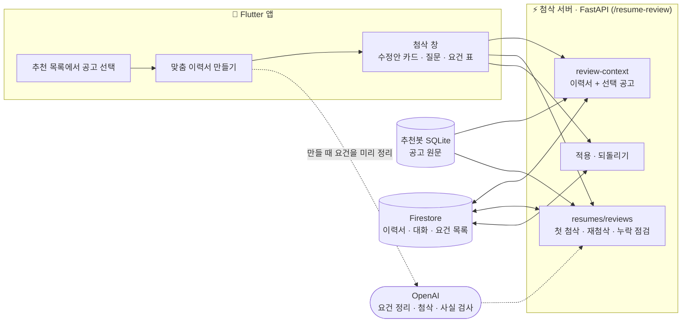
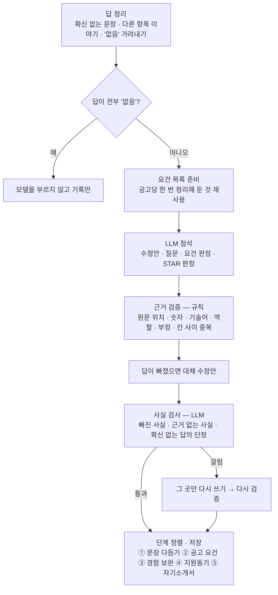
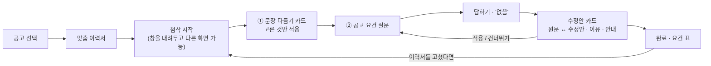

# ✍️ 공고 맞춤 이력서 첨삭

> 고른 채용공고와 학생 이력서를 대조해 **문장별 수정안과 확인 질문**을 주고, 답을 받아 그 사실로 다시 첨삭합니다.
> 이력서와 답에 없는 사실은 수정안에 들어가지 못합니다.


LMS 앱의 **공고 맞춤 첨삭 창**을 맡는 서버입니다. [채용공고 추천봇](../job_matching_bot/README.md)에서 공고를 고르면
그 공고의 원문을 추천봇 저장소에서 읽어 첨삭합니다. 맞춤 이력서(공고별 사본) 만들기·수정안 적용·되돌리기도 맡습니다.

---

## 📚 문서

| 무엇 | 위치 |
|---|---|
| 입력 데이터 · 전처리 | 이력서 입력·개인정보 처리 [docs/resume-review-v2.md](docs/resume-review-v2.md) · 공고 요건 정리 [docs/resume-review-v3.md](docs/resume-review-v3.md) · 평가 케이스 [`evaluation/fixtures/`](evaluation/fixtures/) · 공고 수집·전처리는 [추천봇 문서](../job_matching_bot/docs/data_preprocessing.md) |
| 시스템 아키텍처 | 아래 그림 · 추천봇과 연결 [docs/matching-integration.md](docs/matching-integration.md) |
| 핵심 코드 | [`app/review_workflow.py`](app/review_workflow.py) 한 턴 흐름 · [`app/resume_review.py`](app/resume_review.py) 근거 검증 · [`app/fact_check.py`](app/fact_check.py) 사실 검사 · [`app/job_requirements.py`](app/job_requirements.py) 요건 정리 |
| 테스트 계획 · 결과 | [docs/resume-review-v3.md](docs/resume-review-v3.md) (회차별 결과·남은 한계) · 적용 API [docs/resume-apply.md](docs/resume-apply.md) |

---

## 🏗 시스템 아키텍처



### 첨삭 한 턴의 흐름



| 설계 | 이유 |
|---|---|
| 공고를 요건 목록으로 정리 | 공고 원문을 통째로 넣던 v2는 첫 첨삭 54.7초였습니다. 요건 목록 + 출력 줄이기로 30초대가 됐고, 맞춤본을 만들 때 미리 정리하면 첫 첨삭이 기다리지 않습니다 |
| 요건 판정은 인용이 있을 때만 | `met`·`partial`은 이력서·답의 연속 인용이 실제로 있어야 남습니다. 없으면 서버가 `unconfirmed`로 낮춥니다 |
| 규칙 검증 + 모델 사실 검사 | 규칙은 이미 본 모양(숫자 빠짐·기술어 추가)만 막고, 처음 보는 표현은 놓쳤습니다. 뜻 대조는 모델에 맡기되 모델이 짚은 구절이 원문에 실제로 있을 때만 믿습니다 |
| 원문 옆에 붙이지 않고 다시 쓰기 | 답을 원문 옆에 따로 붙이면 사실은 지키지만 문장이 매끄럽지 않습니다. 매끄럽게 쓰고 틀린 곳만 짚어 한 번 더 쓰게 합니다 |

---

## ✨ 주요 기능

| 기능 | 설명 |
|---|---|
| 문장 다듬기 묶음 | 새 사실 없는 표현 수정(명사형 잇기·맞춤법·문체)을 한 카드로 묶어 고른 것만 한 번에 적용 |
| 공고 요건 대조 | 필수·우대·주요 업무별로 이력서 근거를 찾고, 근거 없는 요건을 질문(지원 자격은 묻지 않고 "확인만") |
| 답변 재첨삭 | 답한 항목을 그 사실로 다시 첨삭. 답에 다른 항목 이름이 나오면 그 항목 칸도 함께 고침 |
| 새 프로젝트 제안 | "개인 과제로 만들었다"처럼 이력서에 없는 경험이면 기존 칸에 끼워 넣지 않고 새 프로젝트로 제안 |
| STAR 점검 | 경험 칸마다 상황·과제·행동·결과가 원문에 인용으로 있는지 판정 |
| 안내 표시 | 다른 칸과 비슷한 문장, 원문 표현이 빠진 곳, 한 일이 약해진 곳에 막지 않고 안내만 붙임 |
| 적용 · 되돌리기 · 재첨삭 | 고른 수정안만 적용·묶음 단위로 되돌리기, 이력서를 고친 뒤에는 처음부터 다시 첨삭 |

### 🧑‍💻 UX 흐름



---

## 🧪 테스트 계획 및 결과

| 층 | 도구 | 무엇을 |
|---|---|---|
| ① 서버 테스트 | `tests/` (pytest 214개) | 근거 검증·답 정리·대체 수정안·사실 검사·적용·맞춤본. 외부 API 없이 가짜 생성기로 |
| ② 대화 평가 | `evaluation/review_eval.py` | 목업 이력서로 첫 첨삭 → 질문마다 답 → 재첨삭 → 누락 점검을 끝까지. 답은 케이스의 `facts`(한 일)·`not_done`(안 한 일)만 아는 지원자 역할 모델이 씁니다 |
| ③ 사람 말투 평가 | `review_eval.py --applicant human` | 짧은 답·항목 이름 줄여 부르기·다른 항목 섞기·"아마 ~했던 것 같아요"·오타 |
| ④ 한 번도 안 본 케이스 | `fixtures/review_cases_unseen*.json` | 서버를 고치는 쪽이 내용을 보지 않은 케이스로 한 번만 측정 |

**평가 원칙** — 개발용으로 고치고, 고칠 때 본 케이스로는 결과를 확인하지 않습니다. 결함을 찾는 데 쓴 세트는 확인용으로 다시 쓰지 않습니다.

| 지표 (개발용 8케이스, 최신) | 결과 |
|---|---|
| 사실 답이 수정안에 반영 | **26/27** (직전 회차 28/28) |
| 지어낸 숫자 · 기술어 · 안 한 일 새어 들어감 | **0 · 0 · 0** |
| 요건 over-claim (근거 없는데 충족으로 판정) | **0** |
| 문장 다듬기 제안 → 적용 | 56/56 |
| STAR 행동·결과 판정 일치 | 89/96 |
| 첫 첨삭 · 후속 첨삭 평균 | 39.2초 · 9.6초 |

한 번도 안 본 케이스(5세트 × 5케이스)에서 도구로 센 지어낸 숫자·기술어는 매번 0이었습니다. 다만 사실이 빠지거나, 다른 항목에 들어가거나, 확신 없는 답을 단정하는 새 모양의 결함이 세트마다 1~2건 나와 모두 고쳤습니다(아래 트러블슈팅). 마지막 세트는 사람 말투 답 29턴 중 2턴이었고, 고친 뒤에는 새 케이스로 다시 재지 않았습니다.

### ✅ 테스트 시나리오 (사용자 관점)

| 입력 | 기대 결과 |
|---|---|
| "잘 모르겠는데 아마 테스트를 30개쯤 작성했던 것 같아요" | 30개를 단정문으로 적지 않음. 확인된 부분만 반영 |
| "개념만 배웠고 실제로 써 본 적은 없어요" | "써 본 적 없다"는 말이 이력서에 들어가지 않음 |
| 교육 칸 질문에 "회사 프로젝트에서 X를 했어요" | X는 그 프로젝트 칸에만, 교육 칸에는 들어가지 않음 |
| 한 문장에 두 프로젝트를 섞어 답함 | 항목 이름 자리에서 나눠 각 칸에 해당 사실만 |
| "없음" | 모델을 부르지 않고 기록, 요건은 "해당 없음" |
| "부트캠프 개인 과제로 카카오맵 마커를 만들었어요" | 기존 팀 프로젝트에 끼워 넣지 않고 새 프로젝트 제안 |
| 원문 "처리 시간을 2.4초에서 0.6초로 줄였습니다"를 되풀이해 답함 | 숫자 결과 문장이 사라지지 않음 |
| 이력서를 고친 뒤 재첨삭 | 지난 대화를 정리하고 처음부터 첨삭 |

---

## 🔧 트러블슈팅

| 문제 | 원인 | 해결 | 결과 |
|---|---|---|---|
| 첫 첨삭 54.7초 · 대화 전체 277초 | 공고 원문 통째 입력, 앱이 안 쓰는 진단 출력 | 요건 목록 입력, 출력 칸 정리, "없음" 답은 모델 생략 | 첫 첨삭 30초대 · 대화 100초 안팎 |
| 수정안이 평균 3개뿐 | 지시문이 "자연스러우면 바꾸지 않는다"로 수정을 누름 | 서술 칸을 모두 살피게 하고 다듬기를 한 카드로 묶음 | 7개 · 한 번에 적용 |
| "재 보는"→"다시 보는" 같은 뜻 흔들리는 교체 | 숫자·기술어 검사로는 안 잡힘 | 6자 이하·5% 미만 표현 교체는 뺌(명사형 잇기 등은 예외) | 자세한 이력서 수정안 25 → 7 |
| 원문을 되풀이한 답에 숫자 결과가 사라짐 | "수정안 = 답 문장"이면 원문 검사를 건너뛰는 예외 | 예외는 한 문장 원문에만, 원문 숫자 빠짐은 예외 없이 보류 | 재발 없음 |
| 다른 항목 이야기가 질문한 칸에도 들어감 | 떼어 낸 문장을 질문한 칸 근거에 남김 | 질문한 칸 근거에서 빼고, 들어가면 `moved_to_other_item`으로 보류 | 재발 없음 |
| "아마 ~했던 것 같아요"가 단정문이 됨 | 확신 없는 문장도 확인된 근거로 씀 | 확신 없는 문장을 근거에서 빼고, 내용이 들어가면 보류 | 서버 테스트로 고정 |
| 새 케이스마다 새 모양의 결함 | 규칙은 이미 본 모양만 막음 | 사실 검사 모델이 뜻으로 대조하고 틀린 곳만 다시 쓰게 함 | 걸리지 않는 턴은 속도 그대로 |

회차별 전체 기록은 [docs/resume-review-v3.md](docs/resume-review-v3.md)에 있습니다.

---

## 🚀 RAG 성능 가이드 대응

| 가이드 | 첨삭 서버 |
|---|---|
| 요청마다 인덱싱하지 않기 | 공고 요건 정리는 공고(내용 해시)당 한 번만 하고 Firestore에 저장, 맞춤본을 만들 때 미리 정리 |
| 문서 고유 ID | 공고 `job_id` + 스냅샷 해시, 이력서 `input_hash`로 옛 판 위에 수정안이 적용되지 않게 함 |
| 서버 시작 시 준비 · 재사용 | 통합 서버 한 프로세스, 설정 캐시 |
| Context 길이 제한 | 후속 첨삭은 답한 항목(과 답에 이름이 나온 항목)만 모델에 보냄, 공고는 답한 요건만 |
| LLM 호출 줄이기 | "없음" 답은 모델 생략, STAR 판정은 첫 첨삭에서만, 사실 검사는 크게 바뀐 수정안(턴당 4개)만 동시에 |
| 병목 측정 | 턴마다 요건 정리·모델·사실 검사·다시 쓰기 시간을 텔레메트리로 남김 |
| 체감 속도 | 첨삭 창을 내려두고 다른 화면을 볼 수 있고, 진행 단계를 카드로 보여 줌 |

---

## 🔭 향후 개선 계획

- **실제 이력서로 확인** — 목업 이력서와 지원자 역할 모델로만 쟀습니다. 동의받은 실제 이력서 몇 개로 직접 첨삭해 봅니다.
- **수정안 차이 색으로 표시** — 빠진 부분·새로 들어간 부분을 앱에서 색으로 보여 주면 검사가 놓친 것을 사용자가 바로 봅니다.
- **첫 첨삭에도 사실 검사** — 지금은 후속 첨삭에만 붙어 있습니다.
- **첫 첨삭 시간 줄이기** — 39~45초입니다. 공고를 고르는 순간 요건을 미리 정리하는 것부터 검토합니다.
- **STAR 판정 흔들림** — 사람 말투 케이스에서 과대 판정이 있어 필요한 질문이 빠질 수 있습니다.
- **새 항목 제안 넓히기** — 지금은 프로젝트만, 경력·교육은 아직입니다.

---

## ⚙️ 실행 방법

설정은 저장소 루트 `.env` 하나를 씁니다(`copy .env.example .env` 후 값 채우기). 첨삭에는 `OPENAI_API_KEY`,
`FIREBASE_PROJECT_ID`, 셸의 `GOOGLE_APPLICATION_CREDENTIALS`(저장소 밖 서비스 계정 JSON 경로)가 필요합니다.
키와 서비스 계정 JSON은 Git이나 Flutter에 넣지 않습니다.

```powershell
# 저장소 루트에서 — 추천봇·첨삭·학생 챗봇·공부방 노트가 8000번 하나로 뜹니다
.\playdata_venv\Scripts\python.exe -m uvicorn app.integrated:app --app-dir cover_letter_rag --host 127.0.0.1 --port 8000

# 서버 테스트 · 대화 평가
cd cover_letter_rag
$env:PYTHONPATH=".."; python -m pytest -q tests
python -m evaluation.review_eval --cases dev --label 이름 --apply-polish
```

| API (`/resume-review` 아래) | 설명 |
|---|---|
| `GET /health` | 모델 이름과 Firebase 설정 여부 |
| `GET /api/v1/resumes/review-context` | 첨삭 창에 보여 줄 이력서·선택 공고 |
| `POST /api/v1/resumes/reviews` | 첫 첨삭, 답변 뒤 재첨삭, 누락 점검 |
| `/api/v1/resumes/{resume_id}/tailored…` | 맞춤 이력서 만들기·조회·세션 저장·삭제·승격 |
| 적용 · 되돌리기 | [docs/resume-apply.md](docs/resume-apply.md) |

**안전 규칙** — ID 토큰의 `uid`가 이력서 소유자일 때만 읽습니다(Admin SDK는 보안 규칙을 우회하므로 이 검사를 없애면 안 됩니다) ·
이름·전화·이메일·생년월일·내부 ID/URL은 모델 입력에서 뺍니다 · 결과는 원본을 덮어쓰지 않고 `aiReviews`에 따로 저장합니다 ·
합격 가능성을 단정하거나 점수화하지 않습니다.

## 📁 폴더 구조

```text
cover_letter_rag/
├── app/
│   ├── integrated.py        # 통합 서버: 공고 추천(/), 첨삭(/resume-review), 학생 챗봇, 공부방 노트
│   ├── main.py              # 첨삭·맞춤 이력서 라우트와 예외 변환
│   ├── review_workflow.py   # 첨삭 한 턴의 흐름: 답 정리 → 모델 → 검증 → 사실 검사 → 저장
│   ├── resume_review.py     # 첨삭 서비스, 수정안 근거 검증
│   ├── fact_check.py        # 뜻 대조 사실 검사와 틀린 곳 다시 쓰기
│   ├── review_rules.py      # 여러 검증이 함께 쓰는 칸 이름·낱말 목록
│   ├── job_requirements.py  # 공고 요건 정리(공고당 한 번 저장)
│   ├── star_checks.py       # 경험 칸 STAR 판정 검증
│   ├── prompts.py           # 첨삭 지시문
│   ├── models.py            # 요청·응답·모델 출력 스키마
│   ├── technology.py        # 기술 이름 정규화
│   ├── matching_handoff.py  # 추천봇 저장소에서 선택 공고 읽기
│   ├── tailored_resumes.py  # 맞춤 이력서 만들기·목록·승격
│   ├── resume_apply.py      # 수정안 적용·되돌리기 API
│   ├── firebase_gateway.py  # Firebase 인증·Firestore 읽기/쓰기와 소유권 검사
│   └── config.py            # 루트 .env 기반 설정
├── evaluation/              # 대화 평가 도구와 케이스(dev · heldout · unseen …)
├── docs/                    # v2 계약 · v3 요건 대조 · 적용 API · 추천봇 연결
└── tests/                   # 외부 API 키 없이 도는 서버 테스트
```
