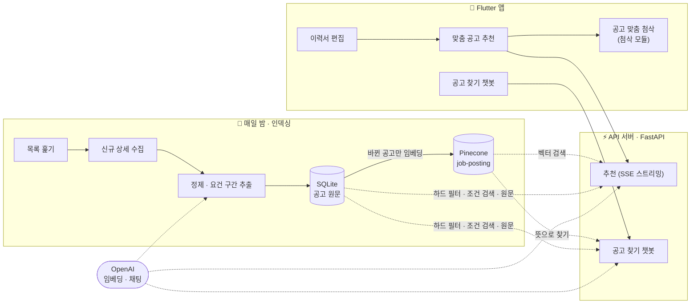
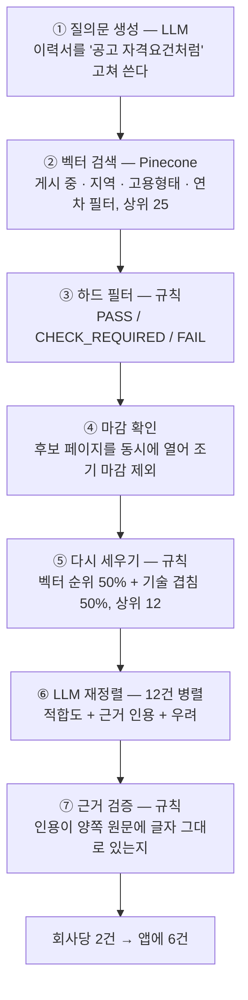
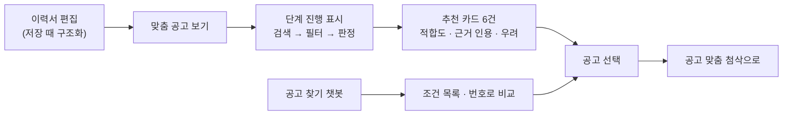

# 🧭 채용공고 추천봇

> 이력서를 넣으면 맞는 채용공고를 골라 주고, **왜 맞는지를 이력서와 공고 양쪽의 원문 인용으로** 보여 줍니다.


LMS 앱의 **맞춤 공고 추천**과 **공고 찾기 챗봇**을 맡는 모듈입니다. 사용자가 추천 목록에서 공고를 고르면
[이력서 첨삭 모듈](../cover_letter_rag/README.md)이 그 공고 기준으로 첨삭을 이어받습니다. 두 모듈은 코드가 나뉘어 있지만
통합 서버 하나(8000번)로 함께 뜹니다.

---

## 📌 프로젝트 주제

**LLM을 연동한 채용공고 기반 질의응답·추천 시스템**
— 채용 사이트의 공개 공고를 수집해 벡터 DB에 담고, 이력서와 사용자의 말을 질의로 삼아 RAG로 공고를 찾고 판정합니다.

## 🎯 프로젝트 목표

- **환각 없는 추천** — 근거는 이력서·공고 원문에 글자 그대로 있는 인용만 인정하고, 없으면 서버가 버립니다.
- **조건은 규칙으로, 적합도는 LLM으로** — 연차·학력·지역·고용형태는 LLM 앞에서 규칙으로 먼저 거릅니다.
- **인덱싱과 서비스 분리** — 수집·정제·임베딩은 매일 밤 한 번, 요청 때는 검색과 판정만 합니다.
- **숫자로 개선** — 모델이 매긴 등급이 아니라 사람 채점과 규칙 결함 검사로 효과를 잽니다.

## 🛠 프로젝트 내용

| 과제 항목 | 이 모듈에서 한 일 |
|---|---|
| 데이터 수집 및 가공 | 공고 목록·상세 수집(차단 신호 시 즉시 멈춤), 요건 구간(주요업무·자격요건·우대사항) 분리, 전공·자격증·조건 추출, 중복·만료 판정 |
| 벡터 DB 생성·저장 | Pinecone `job-posting`(1536차원, cosine)에 공고 1건 = 벡터 1개, 필터용 메타데이터와 요건 원문 1,200자 저장. 바뀐 공고만 다시 임베딩 |
| 프롬프트 템플릿 | LangChain `ChatPromptTemplate` + 구조화 출력. 질의문 생성은 one-shot, 재정렬은 좋은 근거 짝과 **근거가 아닌 짝**을 함께 보여 주는 few-shot |
| LLM 선택 | OpenAI 채팅 모델(질의문·재정렬·챗봇), `text-embedding-3-small`(임베딩) |
| RAG 연동 | 이력서 → 질의문 → 벡터 검색 → 하드 필터 → 마감 확인 → 기술 겹침 재정렬 → LLM 판정 → 근거 검증 |
| 테스트 및 개선 | 단위 테스트, 규칙 결함 검사, 사람 채점 추천 평가, 챗봇 3층 평가, 단계별 응답 시간 측정 |

---

## 📦 필수 산출물

| 산출물 | 위치 |
|---|---|
| 수집된 데이터 및 데이터 전처리 문서 | [docs/data_preprocessing.md](docs/data_preprocessing.md) · 수집 규칙 [crawling/README.md](crawling/README.md) |
| 시스템 아키텍처 | [docs/architecture.md](docs/architecture.md) · 모듈 구조 [docs/modules.md](docs/modules.md) · 그림 원본 [docs/graphs/](docs/graphs/) |
| RAG 기반 LLM + 벡터 DB 연동 코드 | [`retrieval/`](retrieval/) 적재·검색 · [`api/`](api/) 추천·챗봇 서비스 · [`sync.py`](sync.py) 증분 적재 |
| 테스트 계획 및 결과 보고서 | [docs/test_report.md](docs/test_report.md) · 챗봇 [docs/chatbot.md](docs/chatbot.md) |

---

## 🏗 시스템 아키텍처



### 추천 한 번의 7단계



| 단계 | 이렇게 한 이유 |
|---|---|
| ① LLM 질의문 | 이력서는 "FastAPI로 API를 개발했습니다"(경험), 공고는 "Python 개발 경험 2년 이상"(요구)으로 쓰여 표현을 맞춰야 검색이 걸립니다 |
| ③이 ⑥보다 앞 | 임베딩만으로 순위를 매기면 신입 이력서에 경력 7년 공고가 3위로 올라왔습니다 |
| ⑤ 기술 겹침 섞기 | 후보 안의 벡터 유사도 폭이 0.042~0.140뿐이었습니다. 사람 판정과의 순위상관이 벡터만 +0.26 → 반씩 섞어 **+0.42** |
| ⑦ 규칙 검증 | 모델은 근거를 지어냅니다. 원문에 없는 인용은 버리고, 근거가 0개면 적합도를 "낮음"으로 내립니다 |

**판정 원칙** — 근거는 인용이다 · 적혀 있지 않은 것과 못 갖춘 것은 다르다(`CHECK_REQUIRED`) · 우대사항은 가산만 한다 ·
이력서로 확인할 수 없는 것은 우려가 아니다 · 합격 가능성을 말하거나 점수화하지 않는다.

---

## 🗂 데이터 수집 · 전처리

| 항목 | 값 |
|---|---:|
| 목록에서 본 줄 (대분류 14개) | 220,666 |
| 저장소 공고 | 38,226 |
| 게시 중 / 만료 / 삭제 | 31,874 / 4,870 / 1,482 |
| 벡터 인덱스 공고 | 23,627 |

```
원본 JSONL → 유효성 검사 → 중복 제거 → 최신 레코드 선택 → 필드 정규화
→ 본문 정제 → 요건 구간 추출 → 상태·품질 판정 → 지문 대조 → 임베딩 → Pinecone 적재
```

- **로그인 없이 공개된 공고만** 받고 지원자·개인정보는 받지 않습니다. 요청 사이 2.5~3.5초를 쉬고, 429·차단 문구가 오면 그 자리에서 멈춥니다.
- **임베딩은 요건 구간만** 합니다. 본문 앞의 분류 경로 줄까지 넣으면 모든 공고의 유사도가 0.37~0.50에 뭉쳤습니다.
- **증분 적재** — 지문(`embed_hash`)이 그대로인 공고는 다시 임베딩하지 않습니다. 한 번은 인덱스 대상 23,627건 중 2,415건만 임베딩했습니다.

자세한 단계별 건수와 판단 근거는 [docs/data_preprocessing.md](docs/data_preprocessing.md)에 있습니다.

---

## ✨ 주요 기능

| 기능 | 엔드포인트 | 설명 |
|---|---|---|
| 맞춤 공고 추천 | `POST /api/v1/jobs/recommend` | 이력서 원문 + 희망 조건 → 적합도·근거 인용·우려·조건 |
| 추천 진행 스트리밍 | `POST /api/v1/jobs/recommend/stream` | 단계가 바뀔 때마다 SSE로 진행 상황 전송 |
| 이력서 구조화 | `POST /api/v1/resume/profile` | 앱이 저장할 때 미리 받아 두면 추천에서 한 단계(약 2.8초)를 건너뜀 |
| 공고 찾기 챗봇 | `POST /api/v1/jobs/chat` | "서울 백엔드 신입" 같은 말 → 조건 검색·뜻 검색·통계 질문·공고 비교 |

<details>
<summary>추천 응답 예시</summary>

```json
{
  "company": "...", "title": "...", "source_url": "...",
  "fit": "높음",
  "reasons": [
    {"claim": "Spring Boot 기반 API를 만든 경험이 있습니다",
     "resume_quote": "주문·결제 REST API를 설계하고 구현했습니다.",
     "job_quote": "Spring Boot 기반 백엔드 서비스 설계 및 개발"}
  ],
  "concerns": ["Kafka 기반 이벤트 처리 경험이 이력서에서 확인되지 않는다"],
  "conditions": {"region": "서울 강남구", "career": "경력무관", "education": "학력무관"},
  "filter_status": "PASS",
  "unknown_conditions": []
}
```

</details>

### 🧑‍💻 UX 흐름



---

## 🧪 테스트 계획 및 결과

| 층 | 도구 | 무엇을 | 결과 |
|---|---|---|---|
| ① 단위 테스트 | `tests/` (37개 파일) | 수집·정제·저장·검색·API, 외부 호출은 가짜 객체 | **670개 통과** |
| ② 규칙 결함 검사 | `evaluation/recommend_check.py` | 신입에게 경력 공고, 희망 지역 밖, 원문에 없는 인용 등 8가지 | 이력서 10종 · 공고 56건 **결함 0** |
| ③ 추천 사람 채점 | `evaluation/recommend_eval.py` | 모델 등급을 가린 채 사람이 1/2/3으로 매김 | 상위 6건 오추천 **7.7% (2/26)**, 등급 일치 **74.4%** |
| ④ 챗봇 평가 | `evaluation/chat_eval.py` | 라우터 대조 · 서버 응답 대조 · 답 문장 사람 채점 | 라우터 **48/48 × 3회**, 서버 **48/48**, 근거율 **15/15**, 지어냄 0 |
| ⑤ 적재 파이프라인 | 야간 배치 리포트 | 신규·만료·삭제·적재 벡터·오류 | 최근 7회 오류 0 |

- **"높음"·"보통"은 믿을 만합니다(91~92%).** "낮음"은 43%를 사람이 추천해 숨기지 않습니다.
- **고친 근거가 된 이력서로 다시 재지 않습니다.** 회차마다 이력서 묶음을 바꿉니다.
- 응답 시간 중앙값 **18.6초**(14.4~22.8초), 그중 60%가 LLM 재정렬(11.0초)입니다. 스트리밍으로 진행을 보여 줍니다.

### ✅ 테스트 시나리오 (사용자 관점)

| 입력 | 기대 결과 | 확인 방법 |
|---|---|---|
| 경력 0년 · 서울 · 정규직 이력서로 추천 | 경력자 공고·서울 밖·계약직 공고 0건 | 규칙 결함 검사 |
| 인용이 원문에 없는 판정 | 그 근거를 버리고, 근거 0개면 "낮음" | 근거 검증 코드·단위 테스트 |
| 챗봇 "백엔드 공고 보여줘" → "서울만" | 직무 백엔드를 유지한 채 지역 서울 추가 | 라우터·서버 대조 |
| 챗봇 "이거 말고 다른 거 보여줘" | 앞에서 본 공고를 빼고 다음 공고 | 서버 대조(두 번 넘겨도 겹치지 않음) |
| 챗봇 "스타트업은 빼고 데이터 분석 신입" | 스타트업 제외 조건이 실제로 걸림 | 서버 대조 |
| 챗봇 "연봉 높은 순으로", "붙을 확률 얼마야?" | 못 하는 요청이라고 안내, 지어내지 않음 | 라우터 대조·사람 채점 |
| 챗봇 욕설 | 정해진 답, LLM 호출 없음 | 단위 테스트 |

---

## 🔧 트러블슈팅

| 문제 | 원인 | 해결 | 결과 |
|---|---|---|---|
| 모든 공고 유사도가 0.37~0.50에 뭉침 | 임베딩 앞 분류 경로 줄이 공고를 비슷하게 만듦 | 요건 구간만 임베딩 | 검색이 공고를 구분 |
| 적합도가 전부 "보통" | 요건 원문을 300자로 잘라 자격요건이 빠짐 | 1,200자로 늘림(공고 88%가 온전히 들어감) | 높음·보통·낮음이 갈림 |
| 신입 이력서에 경력 공고 | 조건을 임베딩 유사도에 맡김 | 하드 필터를 LLM 앞에 두고 결함 검사 도구화 | 결함 0 |
| `JavaScript`가 기술로 안 잡힘 | 사이트가 `script` 글자에 HTML 주석을 끼움 | 주석을 먼저 지우고 텍스트 추출 | 기술 매칭·인용 검증 복구 |
| 목록에서 안 보인 공고를 지우면 살아 있는 공고까지 삭제 | 목록 노출은 마감 신호가 아님 | 이틀 연속 안 보이면 상세를 열어 확인 후 삭제 | 잘못 지우는 공고 방지 |
| 챗봇 "이거 말고"에 같은 공고 | 서버가 보여 준 공고를 모름 | 앱이 본 공고를 보내고 서버가 빼고 다음을 줌 | 끝까지 넘겨 볼 수 있음 |
| "추천 10초대"가 실제와 다름 | 기록 없이 눈으로 본 값 | 단계별 시간을 로그·응답에 남김 | 실측 18.6초, 병목은 재정렬 |

전체 표(16건)는 [docs/test_report.md#4-트러블슈팅](docs/test_report.md)에 있습니다.

---

## 🚀 RAG 성능 가이드 대응

| 가이드 | 추천봇 |
|---|---|
| 요청마다 인덱싱하지 않기 | 인덱싱은 야간 배치(`sync.py`)에서만. 요청은 검색 + 판정만 |
| 변경분만 증분 인덱싱 | `embed_hash` ≠ `indexed_embed_hash`인 공고만 임베딩 |
| 문서 고유 ID · 메타데이터 필터 | `job_id`를 벡터 ID로 고정 · 게시 상태·지역·고용형태·연차를 검색과 동시에 필터 |
| 청킹 | 하지 않음. 요건 구간만 넣어 문서 중앙값 500자 안팎 |
| 서버 시작 시 객체 재사용 | 서비스 객체는 모듈 로드 때 한 번, Pinecone 클라이언트는 캐시 |
| top-k 조절 | 검색 25 → 필터 → 재정렬 12 → 표시 6 |
| Hybrid Search · Reranking | BM25 대신 규칙 기반 기술 겹침을 섞음(⑤) · LLM 재정렬 12건 병렬(⑥) |
| Context 길이 제한 | 공고당 요건 1,200자만 LLM에 전달 |
| LLM 호출 줄이기 | 이력서 구조화를 앱이 미리 받아 두면 건너뜀 |
| Streaming · 시간 측정 | SSE 단계 진행 · `[추천 시간]` 로그와 응답 `timings_ms`에 단계별 시간 |

---

## 🔭 향후 개선 계획

- **판정 흔들림 줄이기** — 같은 공고의 등급이 12% 바뀝니다. 회차 비교가 이 흔들림에 묻힙니다.
- **재정렬 시간 줄이기** — 전체의 60%입니다. 건수·모델·추론 강도는 적합도와 함께 사람 채점으로 잽니다.
- **마감 확인을 재정렬과 동시에** — 순서대로 기다리는 2.6초를 줄일 수 있습니다.
- **채점자 한 명 더 · 새 이력서 묶음** — 채점자 간 일치도가 없고 표본이 작습니다(회차당 43~50건).
- **야간 배치를 서버로** — 지금은 노트북 작업 스케줄러에서 돌아 노트북이 꺼진 밤은 건너뜁니다.

---

## ⚙️ 실행 방법

API 키는 저장소 루트 `.env` 한 곳에 둡니다. 키를 코드나 문서에 적지 않습니다.

```
OPENAI_API_KEY=
PINECONE_API_KEY1=                # 채용공고 인덱스 키 (공지·정책 쪽은 PINECONE_API_KEY2)
PINECONE_INDEX=job-posting        # 생략하면 job-posting
OPENAI_MODEL=                     # 생략하면 코드 기본값
OPENAI_EMBEDDING_MODEL=           # 생략하면 text-embedding-3-small
CORS_ALLOW_ORIGINS=               # 쉼표로 구분
```

```powershell
py -3.12 -m venv playdata_venv
playdata_venv\Scripts\activate
pip install -r requirements.txt
```

패키지로 설치하지 않고 저장소 루트에서 `python -m job_matching_bot.<모듈>`로 실행합니다.

| 할 일 | 명령 |
|---|---|
| 테스트 (외부 접속 없음) | `python -m unittest discover -s job_matching_bot/tests -t .` |
| 수집 | `python -m job_matching_bot.crawling.crawl_list --all-categories --sort AD --page-count 100`<br>`python -m job_matching_bot.crawling.detail_queue`<br>`python -m job_matching_bot.crawling.crawl_detail --limit 1000` |
| 증분 적재 | `python -m job_matching_bot.sync` (`--dry-run` 미리 보기, `--skip-index` 정제까지만) |
| 메타데이터만 갱신 | `python -m job_matching_bot.retrieval.refresh_metadata` |
| 통합 서버 (첨삭·학생 챗봇 포함) | `python -m uvicorn app.integrated:app --app-dir cover_letter_rag --host 127.0.0.1 --port 8000` |
| 공유 공고 DB 확인 후 서버 시작 | `.\scripts\start-backend.ps1` |

## 📁 폴더 구조

```text
job_matching_bot/
├── crawling/     목록·상세 수집, 야간 배치, 스케줄 등록
├── ingestion/    원본 → Job 정규화. 요건 구간 분리, 전공·자격증 추출, SQLite 저장소
├── retrieval/    Pinecone 적재·검색, 챗봇 조건 조회·집계, 중복·만료 판정, 마감 확인
├── matching/     하드 필터, 기술 겹침 사전 순위, 기술명 표준화
├── api/          FastAPI. 추천·챗봇 서비스, 프롬프트, 가드레일
├── coach/        공고 본문 요구역량 추출
├── evaluation/   사람 채점 도구, 규칙 결함 검사, 챗봇 평가
├── sharing/      팀원 공유용 슬림 저장소 생성·업로드
├── exporters/    앱(Dart)으로 내보내기 — 가상 이력서, 기술 이름
├── schemas/      Job / ResumeProfile / 원본 레코드
├── fixtures/     평가 케이스·사람 채점 라벨·결함 검사 기록
├── docs/         전처리·아키텍처·모듈·챗봇·테스트 문서
├── sync.py       수집 원본 → 저장소 → 인덱스 (증분)
└── tests/        외부 접속 없이 도는 단위 테스트
```

## 🤝 팀 · 협업

| SKN34 3rd 2팀 |
|---|
| 김기호 · 김대호 · 문성호 · 최성욱 |

- **GitHub Flow** — 기능마다 `feature/*` 브랜치에서 작업하고 `develop`으로 병합합니다.
- **커밋 규칙** — `<type> S32-N) 작업 이름` (feat · fix · docs · test · refactor · chore), Jira 티켓 번호와 연결합니다.
- **평가 원칙** — 고칠 때 본 케이스로 결과를 확인하지 않고, 모델 등급을 정답으로 쓰지 않습니다.
