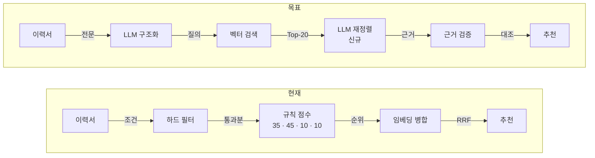
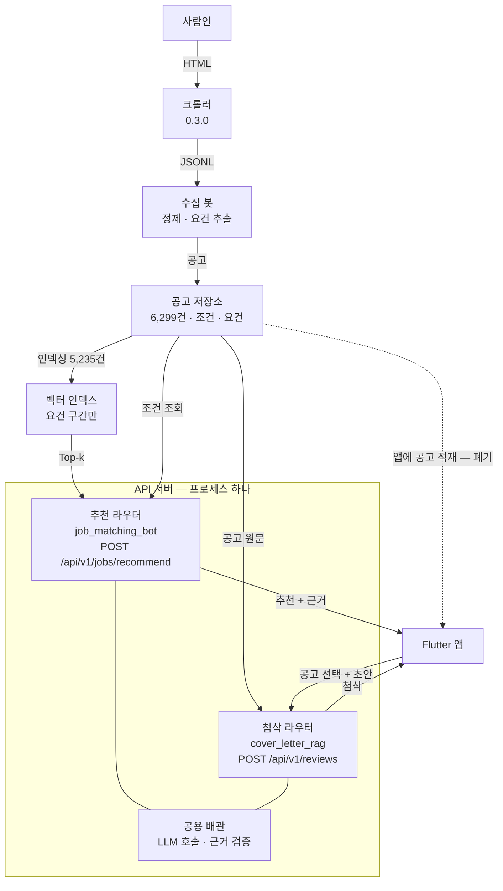

# AI 취업 코치 아키텍처 (3판)

이력서를 읽고 채용공고를 추천하는 RAG 기반 LLM 시스템.
공고는 서버가 갖고, 검색과 LLM 재정렬이 순서와 이유를 만들며, 규칙은 사실을 검증한다.

아래 수치는 전부 수집한 공고 8,654건과 목업 이력서 5개로 실제 측정한 것이다.

| | |
|---|---|
| 기준일 | 2026-09-04 |
| 브랜치 | `feature/job-matching-bot` |
| 수집 | 크롤 완료 · 정제 대기 |
| 열린 결정 | 1건 |
| 착수 순서 | LLM 우선 |

> 같은 내용의 웹 문서: <https://claude.ai/code/artifact/a8ad9bcd-26ae-4df1-a914-11ab8c447bbb>
> (브라우저에서 인쇄 → PDF로 저장하면 PDF본이 된다)

---

## 1. 한눈에

| 결정 | 내용 | 이유 |
|---|---|---|
| 순서를 정하는 주체 | 규칙 점수 → **LLM 재정렬** | 벡터 검색이 후보를 가져오고, LLM이 이력서 근거와 공고 요건을 대조해 순서와 이유를 만든다 |
| 공고를 갖는 쪽 | 앱 소스 → **서버** | 앱은 공고를 들고 있지 않는다. 이력서를 보내고 근거가 붙은 결과를 받는다 |
| 규칙의 새 역할 | 1차 정렬 → **가드레일** | 하드 필터는 후보를 좁히고, 근거 검증은 LLM이 지어낸 인용을 제거한다 |
| 착수 순서 | 데이터 정비 → **LLM 먼저** | 추천 경로에 LLM이 하나도 없다. 인덱스 적재와 추천 엔드포인트를 먼저 세운다 |

---

## 2. 지금까지 한 것

기업이 등록한 기술 태그를 저장하지 않던 크롤러를 0.3.0으로 올려 5,353건을 다시 받았다.
이 한 번의 재크롤이 지금까지의 가장 큰 병목을 풀었다.

**기술 태그 검출률: 1.5% → 57%**

| 단계 | 건수 | 비고 |
|---|---:|---|
| 목록 수집 | 11,882 | 제목·회사·직종·조건 |
| 상세 수집 | 8,654 | 본문·요건·태그 — **완료** |
| IT 필터 통과 | 6,299 | 추천 대상 |
| 요건 문장 있음 | 5,235 | 벡터 인덱스에 넣을 공고 (83%) |

이미지 공고 2,165건 중 1,127건에서도 태그를 확보했다.
본문을 읽을 수 없어 매칭이 불가능했던 공고들이다.

### 규칙만으로 뽑히는 것

저장 없이 정제를 시뮬레이션한 결과다. LLM을 부르지 않고 본문의
"자격요건 / 우대사항" 구간을 잘라 사전 매칭만 했다. 비용은 0이다.

| 항목 | 비율 |
|---|---:|
| 기술 근거 하나라도 | 68% |
| 기업 기술 태그 | 40% |
| 필수 기술 | 39% |
| 우대 기술 | 30% |
| 전공 요건 | 13% |
| 자격증 요건 | 4% |
| 병역 요건 | 2% |

가장 많이 요구된 기술은 Python 1,129건, SQL 844건, Linux 807건, Java 793건, Git 739건 순이다.
부트캠프 수료생 이력서와 맞물리는 분포다.

필수 기술이 39%에 그치는 것은 구간을 못 찾아서가 아니라 **사전에 없는 기술이라 놓친** 경우가 많기 때문이고,
LLM 추출을 얹으면 가장 크게 개선되는 지점이 여기다.

---

## 3. 왜 이 구조인가

규칙만으로도, 임베딩만으로도 추천이 성립하지 않는다는 것을 실험으로 확인했다.
두 방식의 **실패 지점이 서로 다르다**는 것이 이 설계의 출발점이다.

### 임베딩만으로 순위를 매겼을 때

실험 스크립트: `job_matching_bot/experiments/embedding_only_ranking.py`
목업 이력서 5개, `text-embedding-3-small`, 임베딩은 캐시되어 재실행 비용이 없다.

| 이력서 | 결과 | 판정 |
|---|---|---|
| 백엔드 신입 | 1위는 규칙과 같았지만 3·4위에 경력 7년·5년 공고가 올라옴 | 조건 무시 |
| 백엔드 경력 3년 | "Java 기반 백엔드/서버개발자 경력" 공고를 3위로 찾아냄. 규칙은 지역으로 탈락시켰음 | 의미 포착 |
| 임베디드 신입 | 상위 6건이 전부 무관한 백엔드·대기업 공고 | 태그형 실패 |
| 전체 | 1위를 뺀 유사도가 0.37~0.50에 뭉쳐 2위 이하 순서는 사실상 잡음 | 점수화 불가 |

임베딩은 **문장으로 적힌 경험**을 이어 주지만 **숫자로 적힌 조건**을 읽지 못한다.
신입에게 경력 7년 공고를 3위로 주는 추천은 이력서를 본 것이 아니다.
반대로 규칙은 표기가 조금만 달라도 놓친다.

그래서 검색이 후보를 가져오고, LLM이 조건까지 읽어 순서를 정하고, 규칙이 마지막에 사실을 확인하는 순서가 된다.

### 인덱싱은 요건 구간만

유사도가 0.37~0.50에 뭉친 원인 중 하나는 공고 본문 앞에 붙는 분류 경로 줄이다.
`IT개발·데이터 > 직무·직업 > 백엔드/서버개발` 같은 줄이 수백 개씩 붙어 모든 공고를 서로 비슷하게 만든다.

실제로 현대모비스 공고는 본문 5,877자 중 분류 줄을 걷어내면 제목 19자만 남는다.

인덱스에는 주요업무·자격요건·우대사항 구간만 넣는다.
문서 길이 중앙값 552자로, 청킹 없이 공고 하나가 문서 하나가 된다.

---

## 4. 목표 파이프라인



앞의 두 칸은 자리만 바뀐다. 하드 필터가 사라지는 것이 아니라 검색 뒤로 물러나 후보를 좁히고,
규칙 점수는 순서를 정하는 자리에서 내려온다.
실제로 늘어나는 것은 **LLM 재정렬 하나**, 그것도 상위 20건에만 돈다.

### 단계별 설계

#### 01. 이력서 구조화 — LLM, 요청당 1회, 캐시 대상

기술스택 필드를 그대로 읽는 대신, 이력서 전문을 읽고 직무 후보와 핵심 역량,
경력 수준, 근거 문장을 뽑는다. "FastAPI로 추천 API를 개발"이 백엔드 직무 신호라는 판단이 여기서 나온다.

- **입력** 이력서 평문 (핵심역량·기술스택·프로젝트·경력·학력·자소서)
- **출력** 직무 후보, 역량 목록, 경력 연차, 검색 질의문
- **실패 시** 규칙 프로필로 내려간다. 추천은 계속된다

#### 02. 벡터 검색 — 임베딩, 서버가 보유한 인덱스

프로젝트 경험과 자기소개서 문장으로 공고를 검색해 Top-20을 가져온다.
인덱스에는 요건 구간만 들어간 5,235건이 올라가 있다.

- **입력** 구조화 질의문
- **출력** 공고 20건과 검색 순위
- **실패 시** 하드 필터 통과분 전체를 후보로 넘긴다

#### 03. 조건 좁히기 — 규칙, 하드 필터

마감·경력·학력·희망 지역·고용형태로 후보를 거른다. **탈락은 이 네 가지에서만 나온다.**
전공·자격증·병역은 공고에 적혀 있어도 `확인 필요`로 남기고 떨어뜨리지 않는다.
공고에 적혀 있지 않은 것과 지원자가 못 갖춘 것은 다르다는 원칙이다.

- **입력** 검색 후보 20건 + 이력서 조건 + 프로필의 희망 조건
- **출력** `통과` / `확인 필요` / `탈락` 판정과 사유 문구
- **주의** 공고 지역에 "전국"이 있으면 어느 희망 지역이든 통과시킨다

#### 04. LLM 재정렬 — LLM, 상위 10건만, **새로 만드는 부분**

이력서와 공고를 나란히 놓고 적합도와 이유를 만든다. 점수 대신 근거 문장이 나온다.
임베딩이 못 읽던 "경력 3년 이상"을 여기서 읽고, 규칙이 놓치던 서술형 요건도 여기서 잡힌다.

```json
{
  "job_id": "SARAMIN-54901935",
  "fit": "높음 | 보통 | 낮음",
  "reasons": [
    {
      "claim": "요구한 Java 백엔드 경험이 프로젝트에 있음",
      "resume_quote": "Spring Boot로 정산 API를 개발했습니다",
      "job_quote": "Java 기반 백엔드 서버 개발 경험"
    }
  ],
  "concerns": ["공고는 경력 3년 이상, 이력서 근거는 1년 6개월"]
}
```

- **입력** 이력서 평문 + 후보 공고 10건 (요건 구간·조건)
- **출력** 공고별 적합도, 근거 쌍, 우려 사항
- **실패 시** 검색 순서를 그대로 쓰고 그 사실을 화면에 표시한다

#### 05. 근거 검증 — 규칙, 이미 있는 코드 재사용

모델이 돌려준 `resume_quote`가 이력서 원문에 연속해서 존재하는지,
`job_quote`가 공고 원문에 있는지 대조한다. 없으면 그 근거를 제거하고 적합도를 내린다.
같은 검증기가 자소서 첨삭에서 이미 돌고 있다.

- **입력** LLM 재정렬 결과
- **출력** 검증된 근거만 남은 추천 목록 + 제거 사유
- **원칙** 근거를 못 대면 순위를 낮추지, 없는 근거를 보여 주지 않는다

### 추천은 엔드포인트 하나로 묶는다

다섯 단계를 따로 부르지 않는다. 추천 엔드포인트 하나가 순서대로 실행한다.
이 엔드포인트는 `job_matching_bot`의 추천 라우터에 속한다.
첨삭(`/api/v1/reviews`)은 사용자가 공고를 고른 뒤에 따로 호출되는 별개 흐름이다.

```
POST /api/v1/jobs/recommend
  이력서 평문 + 희망 조건
    → LLM 구조화 (invoke)     직무 후보, 역량, 검색 질의문
    → 벡터 검색                Top-20
    → 하드 필터                조건으로 후보 좁히기
    → LLM 재정렬 (invoke)     적합도 + 근거 쌍
    → 근거 검증                인용 대조
  ← 추천 목록 + 근거 문장
```

**첫 구현부터 추천 한 번에 LLM이 두 번 돈다.**
구조화와 재정렬을 따로 만들 이유가 없다. 같은 배관을 쓰고,
검색 질의가 나빠지면 재정렬이 나쁜 후보만 다시 정렬하게 되기 때문이다.

배관은 이미 서버에 있다. `cover_letter_rag/app/service.py`의 `_build_generator`가
프롬프트와 Pydantic 스키마를 받아 체인을 만들고 `chain.invoke`를 돌려준다.

```python
chain = PROMPT | model.with_structured_output(Schema, method="json_schema")
return chain.invoke
```

새로 만들 것은 스키마 둘(`ResumeProfile`, `JobFit`)과 프롬프트 둘,
서비스 메서드 하나와 엔드포인트 하나다. 근거 검증은 기존 `enforce_grounding`을
공고 쪽 인용까지 보도록 넓히면 된다.

---

## 5. LLM이 도는 자리

이 시스템에서 LLM은 세 곳에서 돈다. 검색은 임베딩이, 검증은 규칙이 맡는다.
**추천 한 번에 LLM이 두 번 개입**하고, 규칙은 그 앞뒤에서 후보를 좁히고 결과를 검증한다.

| 단계 | 담당 | 지금 상태 | 비용 |
|---|---|---|---|
| 이력서 구조화 | **LLM** | 미구현 — 규칙 프로필 사용 중 | 요청당 1회, 캐시 |
| 벡터 검색 | 임베딩 | 인덱스에 실제 공고 없음 | 1회 $0.04 |
| 조건 좁히기 | 규칙 | 동작 중 | 0 |
| 재정렬 | **LLM** | 미구현 | 요청당 입력 4.5K · 출력 1.2K 토큰 |
| 근거 검증 | 규칙 | 첨삭에만 연결됨 | 0 |
| 요건 추출 (수집) | **LLM** | 규칙으로 대체해 둠 | 공고당 1회, 캐시 |

### 지금 추천 경로에 LLM이 없다

설계는 위와 같지만, 현재 실제로 돌아가는 추천에는 LLM이 **하나도 들어가지 않는다.**
비용과 결정적 동작을 우선하다 보니 매번 규칙 쪽으로 기울었고,
그 결과 LLM 프로젝트인데 LLM이 도는 곳이 없는 상태가 됐다.

측정해 보니 비용은 판단 근거가 될 규모가 아니었다.

- 임베딩 전량 적재: **$0.04**, 1회
- 재정렬: 학생 30명이 5번씩 써도 입력 0.68M · 출력 0.18M 토큰
- 규모가 있는 것은 요건 추출 하나뿐이고, 이것도 캐시되어 1회다

그래서 실행 순서를 **LLM 우선**으로 뒤집는다. 인덱스를 올리고 재정렬을 붙이는 것이 먼저고,
규칙 정제와 스케줄링은 그 뒤다.

### 규칙을 남기는 이유

없애자는 것이 아니라 **뒤로 보내는** 것이다. 두 가지 일을 맡는다.

- **하드 필터** — 경력 7년 공고가 신입에게 가는 것을 막는다. 임베딩 실험에서 실제로 일어난 일이다
- **근거 검증** — 모델이 만든 인용이 원문에 실제로 있는지 대조한다. 없으면 제거하고 적합도를 내린다

둘 다 LLM 출력을 검증하는 역할이지, 순서를 정하는 역할이 아니다.

---

## 6. 시스템 배치



점선이 없어지는 경로다. 공고 2,241건을 앱 소스에 박아 생성 파일이 8.6MB가 됐고,
6,299건이면 22MB가 된다. 앱이 공고를 갖지 않으면 이 문제 자체가 사라진다.

### 모듈 경계와 배포 단위는 다른 문제다

두 봇의 역할은 명확히 나뉜다.

- **`job_matching_bot`** — 채용공고를 수집하고 **추천**한다. 벡터 인덱스를 소유한다
- **`cover_letter_rag`** — 사용자가 **고른 공고 하나**에 맞춰 이력서를 피드백한다

이 경계는 모듈로 지키되, **프로세스는 하나로 둔다.**
FastAPI 앱 하나가 두 모듈을 각각 라우터로 올린다.
서버를 둘 띄울 부담이 없고, LLM 호출과 근거 검증 배관을 한 벌만 유지한다.
나중에 나눠야 하면 라우터를 떼어 별도 프로세스로 올리면 된다.

첨삭 쪽은 **벡터 검색이 필요 없다.** 사용자가 고른 공고를 이미 알고 있기 때문이다.
지금 `/api/v1/reviews`가 유사 공고를 검색하는 것은 참고 맥락용인데,
역할을 나누면 그 호출은 빼도 된다.

### 겹치는 배관을 한 벌로

지금 두 모듈이 같은 일을 서로 다른 방식으로 하고 있다. 라우터를 합칠 때 정리한다.

| 겹치는 것 | job_matching_bot | cover_letter_rag | 정리 |
|---|---|---|---|
| LLM 호출 | OpenAI SDK `chat.completions.parse` | LangChain `with_structured_output` | LangChain으로 통일 |
| 공급자 교체 | CLOVA 지원 있음 | 없음 | 공용 배관으로 이동 |
| 응답 캐시 | 있음 (요건 추출) | 없음 | 공용 배관으로 이동 |
| 환각 검증 | `drop_unevidenced` | `enforce_grounding` | 하나로 합침 |
| 설정 | `env.py` | `.env` + `config.py` | 한 곳에서 읽음 |

### 모듈이 맡는 일

| 모듈 | 맡는 일 | 이 설계에서 |
|---|---|---|
| `crawler_poc/` | 목록·상세 수집, 해시태그 블록 기록 | 완료 |
| `job_matching_bot/` | 수집·정제 + **추천**(검색·재정렬), 벡터 인덱스 | 추천 라우터 추가 |
| `cover_letter_rag/` | 선택한 공고에 맞춘 **이력서 피드백** | 벡터 검색 의존 제거 |
| 공용 배관 | LLM 호출, 스키마 강제, 캐시, 근거 검증 | 새로 뽑아냄 |
| `functions/` | 조건 판정, 분석 결과 저장 | 서버 호출 중계 |
| `lib/.../ai_coach/` | 준비 상태, 추천 카드, 근거 상세 | 생성 파일 의존 제거 |

### 앱에서 걷어낼 것

생성 파일 `collected_jobs.g.dart`를 지금 세 군데서 쓴다. 공고가 서버로 가면 각각 이렇게 정리된다.

| 쓰는 곳 | 지금 | 바뀌는 것 |
|---|---|---|
| 로컬 fixture 추천 | 클라이언트가 점수 계산 | 서버가 대신한다 — 제거 |
| 채용공고 찾기 챗봇 | 클라이언트에서 직접 검색 | 서버 검색으로 이전 |
| 기술스택 태그 후보 | 공고에서 기술명 수집 | 이름 목록만 남긴다 — 경량 유지 |

---

## 7. 운영: 공고를 어떻게 최신으로 유지하나

한 번 크게 받는 것으로는 유지되지 않는다. 이번에 받은 공고 중 상당수가 이번 달 안에 마감된다.
다행히 저장소는 처음부터 증분 수집을 전제로 만들어져 있어, 붙일 것은 스케줄러뿐이다.

### 이미 있는 것

저장소 레코드는 `first_seen_at`, `last_seen_at`, `missing_runs`, `revisions`를 갖는다.
수집할 때 목록에서 본 공고 ID를 넘기면 `신규` / `갱신` / `만료`를 스스로 판정한다.
목록에서 **연속으로** 사라진 공고만 삭제로 넘어가므로, 한 번의 수집 실패가 공고를 지우지 않는다.


비용이 드는 상세 크롤과 임베딩은 신규·변경분에만 적용되므로,
첫 적재 이후에는 하루 수백 건 규모로 유지된다.

### 주기와 실행 위치

| 작업 | 주기 | 분량 | 실행 위치 |
|---|---|---|---|
| 목록 훑기 | 매일 1회 | 약 12,000건 · 20분 | Cloud Run 작업 |
| 신규 상세 크롤 | 매일 1회 | 일 수백 건 · 30분 내 | Cloud Run 작업 |
| 정제 · 저장 | 크롤 직후 | 수 분 | 같은 작업 |
| 인덱스 갱신 | 정제 직후 | 신규분만 임베딩 | 같은 작업 |
| 만료 정리 | 매일 | 마감일 경과 + 목록 미관측 | 저장소가 판정 |

목록은 한 페이지 50건이라 12,000건이면 약 240페이지, 요청 간격을 지켜도 20분 안팎이다.

Cloud Functions는 실행 시간 제한이 있어 크롤에 맞지 않는다.
**Cloud Scheduler가 Cloud Run 작업을 깨우는 구성**이 맞다.
새벽 시간대에 돌리면 사람인 쪽 부하도 적다.

### 지켜야 할 것

- 차단 문구나 429가 오면 그날 작업을 중단하고 알린다. 간격을 줄이거나 재시도해 뚫지 않는다
- 실패해도 저장소를 지우지 않는다. 목록에서 연속으로 안 보일 때만 삭제로 넘어간다
- 임베딩은 내용 해시가 바뀐 공고만 다시 만든다. 매일 전량을 다시 임베딩하지 않는다
- 수집 결과를 매일 기록으로 남겨, 태그 검출률이 떨어지면 사이트 구조 변경을 바로 알아챈다

---

## 8. 무엇이 그대로이고 무엇이 새로 생기나

구조를 바꾼다고 만들어 둔 것을 버리지 않는다.
새 코드는 서버 엔드포인트 하나와 그것을 부르는 앱 쪽 호출부가 전부다.

| 영역 | 지금 | 바뀌는 것 |
|---|---|---|
| 수집 파이프라인 | 크롤러 · 정제 · IT 필터 · 저장소 | 그대로 |
| 요건 추출 | 구간 규칙 + LLM, 캐시 있음 | 실행만 하면 됨 |
| 임베딩 검색 | 공고 검색 API 동작 중 | 인덱스에 5,235건 적재 |
| 근거 검증 | 인용 대조기 동작 중 | 재정렬 결과에도 적용 |
| 하드 필터 | 탈락 4종 + 확인 필요 다수 | 검색 뒤로 이동, 계산식 동일 |
| 규칙 점수 | 순위를 결정 | 보조 표시로 내려감 |
| 화면 | 준비 상태 · 추천 카드 · 근거 상세 · 조건 표 | 채우는 값만 교체 |
| 자소서 첨삭 | 공고 선택 후 실행 | 그대로 |
| 생성 파일 | 공고 전량을 앱 소스에 적재 | **폐기** |
| **추천 라우터** | 없음 | **새로 만듦** — 구조화 + 재정렬 |
| **공용 배관** | 두 모듈에 따로 | 한 벌로 합침 |

---

## 9. 결정

### 정리됨 — 공고를 어디에 둘 것인가

앱에 두지 않는다. 서버가 저장소와 벡터 인덱스를 갖고, 앱은 이력서를 보내고 결과를 받는다.
앱 소스 크기 문제와 갱신 주기 문제가 함께 없어진다.

### 정리됨 — 어디까지 크롤할 것인가

마감 9/16 이후 5,353건을 마감이 늦은 순으로 받아 완료했다. 실패 6건, 차단 없음.
9월 상반기 마감 공고는 곧 만료되므로 받지 않았다. 운영에서는 신규 공고만 증분 수집한다.

### 남음 — 벡터 인덱스와 서버를 어디서 돌릴 것인가

지금은 로컬 Chroma다. 앱이 붙으려면 서버가 떠 있어야 하고,
현재 서버에는 CORS 설정이 없어 웹에서 직접 호출할 수 없다.
공고 5,235건 규모는 Chroma가 충분히 감당한다.

- Chroma를 그대로 배포한다. 벤더가 늘지 않는다
- 관리형 벡터 DB로 옮긴다. 운영 부담은 줄지만 벤더와 비용이 는다
- Cloud Functions가 서버를 중계해 앱이 직접 호출하지 않도록 한다

---

## 10. 실행 순서

LLM이 도는 것을 먼저 세우고, 데이터 정비와 운영은 그 뒤에 붙인다.

| | 작업 | 내용 | 비용 |
|---|---|---|---|
| ✓ | 해시태그 블록 재크롤 | 기술 태그 1.5% → 57%. 이미지 공고 2,165건 중 1,127건에도 근거 확보 | 완료 |
| ✓ | 규칙 정제 시뮬레이션 | 저장 없이 결과만 확인. IT 6,299건, 기술 근거 68%, RAG 후보 5,235건 | 완료 |
| 3 | 정제 저장 + **인덱스 적재** | 저장소를 채우고 요건 구간 5,235건을 임베딩한다. 이때부터 RAG가 동작한다 | $0.04 |
| 4 | **추천 라우터** | `POST /api/v1/jobs/recommend`에 LLM 구조화와 재정렬을 함께 넣는다. 첨삭 라우터와 한 프로세스에 올린다 | 요청당 LLM 2회 |
| 5 | 앱을 서버 호출로 전환 | 생성 파일 의존을 걷어내고 추천 카드에 근거 문장을 채운다 | 표시 교체 |
| 6 | **LLM 요건 추출** | 인덱스 후보 5,235건에 적용. 필수 기술 39%의 사전 한계를 푼다 | 공고당 1회 · 캐시 |
| 7 | 증분 수집 스케줄링 | 매일 목록을 훑어 신규만 상세를 받고 인덱스를 갱신 | Cloud Run · 일 1회 |

3번까지 끝나면 검색이 실제 공고를 반환하고, **4번에서 추천 경로에 LLM이 들어간다.**
6번은 품질 개선이라 뒤에 두었지만, 표본 100건으로 규칙과 비교한 뒤 전면 적용 여부를 정한다.

---

## 부록: 규칙 동기화 대상

점수와 하드 필터 규칙은 세 곳에 같은 값으로 존재한다. 하나를 고치면 나머지도 고쳐야 한다.

- `job_matching_bot/matching/ranking.py`, `matching/hard_filter.py`
- `functions/src/jobCoach.ts`, `src/jobCoachScoring.ts`
- `lib/features/resume/ai_coach/data/local_job_matcher.dart`

실측 기준 2026-09-04 · 상세 8,654건 · IT 6,299건 · 목업 이력서 5개
