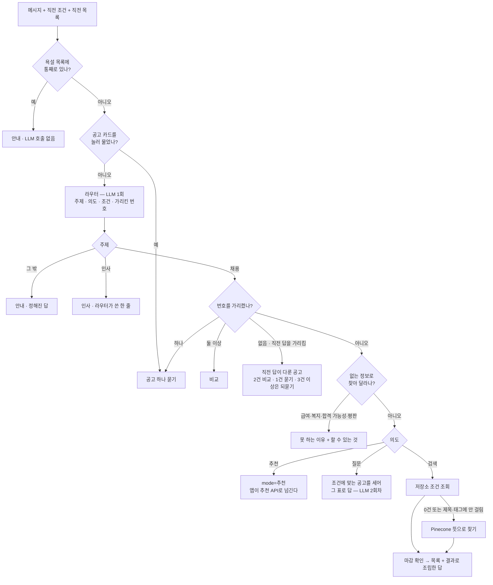

# 공고 찾기 챗봇

LLM은 **무엇을 원하는 말인지 가르고 조건만 뽑는다.** 공고를 찾고 건수를 세는 일은
저장소(SQLite)가 하고, 검색 답 문장은 **실제 조회 결과로 조립한다.** 질문·공고·비교에
답을 쓸 때는 LLM이 쓰되 근거(공고를 센 표, 공고 원문)를 함께 준다.

전체 구조는 [architecture.md](architecture.md), 평가 방법과 결과는
[test_report.md](test_report.md)에 있다.

## 1. 추천과 무엇이 다른가

| | 추천 | 챗봇 |
|---|---|---|
| 무엇으로 찾나 | 이력서 | 사용자가 말한 조건 |
| 어디서 찾나 | Pinecone 벡터 | 저장소 조건 조회. 제목·태그에 안 걸리면 Pinecone으로 뜻 검색 |
| 찾는 범위 | 인덱스에 올린 공고 23,627건 | 상세를 받은 OPEN 공고 31,874건 + **목록에서만 본 공고**(IT 밖 대분류 포함) |
| LLM 호출 | 요청당 13번(구조화 1 + 재정렬 12 병렬) | 갈래마다 0~2번 |
| 대화 저장 | — | 하지 않는다. 앱이 직전 조건과 목록을 되돌려 보낸다 |

목록에서만 본 공고는 본문이 없다. 회사·제목·직무 태그·조건·링크로만 찾고, 상세를 받은
공고보다 늘 뒤에 선다.

## 2. 말 한 마디가 지나는 길



**건수는 실제 결과에서 온다.** 검색 답을 LLM이 통째로 쓰면 없는 공고를 있다고 말한다.

## 3. 답이 나오는 여섯 갈래

| mode | 언제 | 근거 | LLM 호출 |
|---|---|---|---|
| `검색` | "서울 백엔드 신입 찾아줘" | 저장소 조회 결과 | 1번(라우터). 답 문장은 결과로 조립 |
| `질문` | "백엔드 신입은 뭘 준비해야 해?" | 조건에 맞는 공고를 센 표. 셀 물음이 아니면 표 없이 | 2번 |
| `공고` | 카드를 누르거나 "2번 자세히" | 그 공고 원문(+ 보냈으면 이력서) | 카드는 1번, 번호로 가리키면 2번 |
| `비교` | "1번하고 3번 비교해줘" | 두 공고 원문(+ 이력서) | 2번 |
| `추천` | "내 이력서로 찾아줘" | — 앱이 추천 API로 넘긴다 | 1번 |
| `안내` | 욕설, 채용 밖, 인사, 없는 정보, 조건이 없음 | — | 0~1번 |

## 4. 막는 것

세 겹이다. 앞의 겹일수록 모델 판단에 기대지 않는다.

1. **욕설 목록**(`api/abuse.py`). 말 한 마디가 통째로 적어 둔 욕일 때만 막고 **LLM을 부르지
   않는다.** 문장 속에 섞인 말은 막지 않는다 — "미친 듯이 준비했는데"는 하소연이다.
2. **주제 문.** 라우터가 `채용` / `인사` / `그 밖` 중 하나를 **반드시** 고른다. 기본값을 두지
   않았고, 채용인지 분명하지 않으면 `그 밖`이다. `그 밖`은 정해진 문장으로 답하므로 모델이
   쓴 글이 나갈 길이 없다. "호구"라고만 보냈는데 뜻풀이가 달려 나간 뒤로 이렇게 바꿨다.
3. **없는 정보.** 급여·복지·합격 가능성·회사 평판으로 찾거나 줄 세워 달라면 못 하는 이유를
   밝히고 할 수 있는 것을 권한다. "조건을 빼 보라"고 하지 않는다 — 빼도 못 찾는다.

## 5. 대화 맥락을 잇는 법

서버는 대화를 저장하지 않는다. 앱이 **네 가지**를 되돌려 보낸다.

| 받는 것 | 없으면 못 하는 것 |
|---|---|
| `filters` — 직전 응답의 조건 | "서울만", "신입으로" 같은 좁히기 |
| `last_job_ids` — 직전 답에 보여 준 공고를 순서대로 | "2번 자세히 봐줘", "1번하고 3번 비교" |
| `last_answer_job_ids` — 직전 답이 **다룬** 공고 | 번호 없이 "두 공고의 자격요건만", "이 공고 마감일은" |
| `seen_job_ids` — 같은 조건으로 **지금까지 보여 준 공고 전부** | "이거 말고"를 거듭해 끝까지 넘겨 보기 |

`last_job_ids`는 번호가 가리킬 **목록**이고 `last_answer_job_ids`는 방금 이야기한 **대상**이다.
뒤엣것이 없으면 비교 바로 뒤에 챗봇이 스스로 내놓은 제안("두 공고의 자격요건만 비교해 주세요")을
눌렀을 때 답하지 못한다.

지키는 것:

- **자리를 job_id로 바꾸는 것은 서버가 한다.** 라우터는 몇 번째인지만 낸다. LLM에게 id를
  다루게 하면 없는 id를 지어낸다.
- **가리키는 말은 떼고 넘긴다.** "2번 자세히 봐줘"를 그대로 주면 모델이 본문 속 항목 번호로
  읽고 "'2번'이 무엇인지 확인하기 어렵다"고 답했다.
- 범위를 벗어난 번호는 버린다. 앞에 보여 준 목록이 없으면 그렇다고 말한다.
- 카드를 눌러 물은 것이 우선이다. 말 속의 번호를 따지지 않는다.
- 직전 답이 다룬 공고가 셋 이상이면 고르지 않고 번호로 되묻는다. 앞의 둘을 집으면 사용자가
  생각한 공고가 아닐 수 있고, 답은 그럴듯해서 틀린 줄도 모른다.

### "이거 말고" — 끝까지 넘겨 보기

라우터가 "이거 말고", "다른 거", "더 보여줘", "또 없어?"를 `show_more`로 가르면, 서버는
`seen_job_ids`를 빼고 **같은 조건에서 안 본 공고**를 다음 5건 준다. 앱은 조건이 그대로인
동안 본 공고를 쌓고, 조건이 바뀌면 새로 센다(`chat_job_refs.dart`의 `nextSeenJobIds`).
직전 목록만 빼면 두 번째 "이거 말고"에 첫 목록이 다시 나오므로 전부 보낸다.

```text
사용자: 프론트엔드 신입 공고 보여줘   → 프론트엔드 · 신입 공고 247건을 찾았어요. 가까운 순으로 5건 보여드릴게요.
사용자: 이거 말고 다른 거 보여줘     → 프론트엔드 · 신입 공고 247건 중 6~10번째예요.
사용자: 이거 말고                   → 프론트엔드 · 신입 공고 247건 중 11~15번째예요.
```

- **이 답에는 라우터가 쓴 한 줄을 붙이지 않는다.** 고치기 전에는 같은 5건을 다시 보여 주면서
  "기존 공고는 제외하고 다른 공고를 찾아보겠습니다"라고 답했다. 몇 번째인지는 서버만 안다.
- 직접 맞은 공고를 다 보면 "N건은 다 보여드렸어요. 본문에만 언급된 공고 M건 중 …"으로 넘어간다.
- 더 없으면 "앞에서 보여드린 N건이 전부예요"라고 말하고 조건을 바꿔 보자고 한다.
- 뜻으로 찾은 목록에서도 같다. 본 만큼 더 가져와 빼고 준다.
- "서울 것만 다시 찾아줘"처럼 조건을 바꾸는 말은 더 보기가 아니라 새 검색이다.

## 6. 비교

자리를 **둘 이상** 가리키면 비교다. 의도를 따로 두지 않았다 — 개수가 곧 신호이고, LLM이 한 번
더 가를 일을 만들지 않는 편이 틀릴 여지가 적다. 앞의 두 건만 비교한다.

- 한쪽에만 적힌 것은 "A에는 있고 B에는 없다"로 쓴다. 적히지 않은 것과 없는 것은 다르다.
- 점수를 매기거나 어느 쪽이 붙기 쉬운지 말하지 않는다.
- 회사 이름으로 부른다. "1번"은 사용자가 본 번호와 어긋날 수 있다.
- 비교하는 사이 한쪽이 마감됐으면 남은 하나에 대한 답으로 내려간다.

프롬프트는 따로 둔다(`api/prompts_compare.py`). 공고 하나를 묻는 프롬프트에는 "다른 공고와
비교하지 않는다"가 있어, 한 파일에 두면 두 규칙이 섞여 읽힌다.

## 7. 조건으로 찾기

`retrieval/store_search.py`. 조건이 여럿이면 모두 만족해야 하고, 직무·기술 말은 그중 하나만
맞아도 된다. 직무·기술 말은 제목·분류 태그·기술 태그·본문 네 곳을 본다.

**어디서 걸렸는지로 순서를 가른다.**

| 관련도 | 말이 있던 자리 |
|---:|---|
| 3 | 공고 제목 |
| 2 | 직무·기술 태그 |
| 1 | 본문에만 |

정렬은 제목·태그에 맞은 공고(관련도 2 이상) → 상세 있는 공고 → 관련도 → 태그를 적게 단 공고 →
최근에 처음 본 공고 순이다. 태그를 열 개씩 단 "전 직군 공개채용"은 무엇을 물어도 걸리므로 그 일에
특화된 공고에 자리를 내준다. 한 번에 3,000행까지 훑는다.

**답이 말하는 건수는 제목·태그에 직접 맞은 공고 수다**("프론트엔드 · 신입 공고 247건을 찾았어요").
직접 맞은 공고가 없을 때만 조건에 맞는 전체를 말한다. 본문에 말이 스친 공고까지 세면 실제보다
훨씬 많아 보인다. 예전 답은 "329건 중 직무가 맞는 건 247건이에요. 관련도 순으로 5건"이었는데,
"직무가 맞는 건"·"관련도"는 사용자가 알 필요 없는 구분이라 뺐다. 응답의 `total`도 답이 말한 수와
같다. 정렬이 직접 맞은 공고를 먼저 세우므로 넘겨 보다 그 수를 넘으면 본문에만 스친 공고가 나온다. **질문 갈래의 집계도 같은 조건 함수를 쓴다** — "412건 중 Spring
61%"라고 말해 놓고 목록에 다른 모수의 공고가 나오면 답이 거짓말이 된다.

### 표기를 접는다

기업이 붙인 태그는 `SpringBoot`인데 사람은 `Spring Boot`라고 친다. 직무 코드표의 키워드 이름 2,016개를
표준키로 묶어 두고, 친 말과 같은 키의 표기를 함께 건다. **친 말은 늘 맨 앞에 둔다** — 태그에
없고 제목이나 본문에만 있는 말도 걸려야 한다. 2026-09-13 저장소 기준:

| 친 말 | 기술 태그에 친 그대로 | 접어서 찾은 공고(제목·태그에 걸린 것) |
|---|---:|---:|
| Spring Boot | 0 | 492 (327) |
| REST API | 0 | 502 (287) |
| K8s | 5 | 653 (208) |
| Node JS | 0 | 409 (251) |

접두사인데 뜻이 다른 말은 따로 막는다. `Java`로 찾으면 JavaScript가, `Go`로 찾으면
MongoDB·Django가 걸리므로 이 둘은 정규식으로 본다.

### 몇 년차인지도 조건이다

"3년차인데 갈 만한 데 있어?"에 경력 5년 이상 공고가 나갔었다. 경력이냐 신입이냐만 보고 숫자를
버렸기 때문이다. 지금은 라우터가 `career_years`를 뽑고 최소 연차가 그보다 큰 공고를 뺀다.
2년 이상이면 신입 전용 공고도 뺀다(추천 하드 필터와 같은 경계).

- **연차 미기재 공고는 빼지 않는다.** 검색은 빠지면 사용자가 아예 못 본다.
- **"신입"이라고만 하면 0을 넣지 않는다.** 0으로 박으면 연차 미기재 공고가 통째로 빠진다.

## 8. 조건으로 못 찾으면 뜻으로 찾는다

"돈 다루는 일", "사람 만나는 일" 같은 말은 조건으로 옮길 말이 없다. 라우터가 공고 자격요건
말투로 고쳐 쓴 `requirement_query`를 내고, 아래 경우에 Pinecone으로 뜻이 가까운 공고를 찾는다.

- 조건이 하나도 안 잡혔다.
- 직무·기술 조건이 있는데 0건이거나, **제목·태그에 걸린 것이 하나도 없다.**

지역·경력만 걸었으면 조건 조회가 정확하므로 뜻으로 찾지 않는다. 뜻으로 찾을 때도 지역·고용형태,
신입이면 최소 경력 1년 이하 조건을 함께 건다. 뜻 검색이 실패해도 대화를 끊지 않고 조건 결과로
답한다. 답에는 "뜻이 가까운 공고를 N건 찾았어요"라고 **어떻게 찾았는지 밝힌다.**

조건도 없고 뜻으로 찾을 문장도 없을 때만 되묻는다.

## 9. 마감된 공고를 안 보여 준다

저장소가 OPEN이라고 해도 사이트에서는 이미 접수마감일 수 있다. 네 곳에서 다시 확인한다.

| 어디서 | 마감이면 |
|---|---|
| 검색 목록 | 목록과 건수에서 뺀다 |
| 질문의 근거 공고 | 붙이지 않는다. 넉넉히 가져와 빈자리를 채운다 |
| 공고 하나 묻기 | "접수가 마감됐어요"라고 답한다 |
| 비교 | 남은 하나에 대한 답으로 내려간다. 둘 다면 그렇다고 말한다 |

하루 안에 확인한 공고는 다시 열지 않는다. 확인이 실패하면 열려 있다고 본다.

목록에서만 본 공고를 물으면 마감이 아니라 **아직 상세를 안 받은 것**이라고 말하고, 목록에
적힌 조건과 원문 링크만 준다. 없는 요건을 지어내지 않는다.

## 10. 프롬프트와 추론 강도

| 프롬프트 | 파일 | 입력 | 출력 |
|---|---|---|---|
| 라우터 `CHAT_PROMPT` | `api/prompts.py` | 말 + 직전 조건 | 주제, 의도, 조건, 가리킨 번호, 직전 답 가리킴, 더 보기, 없는 정보, 뜻 검색 문장, 확인 한 줄 |
| 질문 `ADVICE_PROMPT` | `api/prompts.py` | 조건 설명 + 센 표 + 물음 | 답, 이어 물을 말 3개 |
| 공고 묻기 `JOB_ASK_PROMPT` | `api/prompts.py` | 공고 원문 + 이력서 + 물음 | 답, 이어 물을 말 |
| 비교 `JOB_COMPARE_PROMPT` | `api/prompts_compare.py` | 공고 둘 + 이력서 + 물음 | 답, 이어 물을 말 |

라우터만 추론 강도를 `low`로 낮췄다. 모든 말이 지나는 호출이라 여기서 줄면 전부 준다. 13가지
말로 재 본 결과(`service.py`의 `CHAT_EFFORT` 주석): `low` 13/13·평균 1.7초, `medium` 13/13·3.0초.
답을 쓰는 호출은 `medium`이다 — 글의 질이 걸린 일이다.

## 11. API

`POST /api/v1/jobs/chat`

```json
{
  "message": "2번하고 3번 비교해줘",
  "filters": {"roles": ["백엔드"], "regions": ["서울"], "career": "신입", "career_years": null},
  "last_job_ids": ["<출처>-1", "<출처>-2", "<출처>-3"],
  "last_answer_job_ids": [],
  "seen_job_ids": ["<출처>-1", "<출처>-2", "<출처>-3"],
  "top_k": 5,
  "job_id": null,
  "resume_text": null
}
```

응답:

```json
{
  "mode": "비교",
  "resume_scope": "전체",
  "reply": "…",
  "filters": {"roles": ["백엔드"], "regions": ["서울"], "career": "신입"},
  "jobs": [{"job_id": "…", "company": "…", "title": "…", "region": "…", "career": "…", "deadline": null, "tech_stack": []}],
  "total": 2,
  "suggestions": ["근무지와 주요 기술 기준으로만 비교해줘."],
  "prompt_version": "job_chat_v1",
  "timings_ms": {"route": 2105, "store": 2, "liveness": 2, "answer": 9034, "total": 11143}
}
```

- `filters`와 `jobs`의 id를 다음 요청에 실어 보내면 말이 이어진다.
- `seen_job_ids`는 같은 조건으로 본 검색 목록을 쌓아 보낸다. 조건이 바뀌면 비운다.
- `total`은 답이 말한 건수다. 검색이면 제목·태그에 직접 맞은 공고 수다.
- `resume_text`는 공고를 놓고 물을 때만 보낸다. "나한테 맞아?"는 이력서를 봐야 답이 된다.
- `mode=추천`이면 `resume_scope`만큼의 이력서로 앱이 추천 API를 부른다.
- `timings_ms`는 지난 단계만 담는다. 서버 로그에도 `[챗봇 시간]` 줄로 남는다.

## 12. 재 본 결과 — 2026-09-13

### 자동 대조

| 층 | 결과 | 응답 시간 중앙값 |
|---|---|---:|
| 라우터 대조 (`--router`) 3회 | 3회 모두 **36/36** | 1.5초 (129턴, 최대 3.4초) |
| 서버 응답 대조 (`--run`) | **36/36** | 2.2초 (43턴, 최대 11.1초) |

### 갈래별 단계 시간

`--run`의 43턴에서 응답에 실린 `timings_ms`를 갈래별로 모았다. 공고·비교는 표본이 1~2건이라
참고만 한다.

| mode | 턴 | 가르기 | 조회·집계 | 마감 확인 | 답 쓰기 | 합계 중앙값 |
|---|---:|---:|---:|---:|---:|---:|
| 검색 | 17 | 1.5초 | 0.3초 | 0.9초 (0~6.5) | — | **2.9초** (1.5~10.3) |
| 질문 | 7 | 1.7초 | 0.7초 | 0.7초(근거 공고) | **4.3초** | **6.0초** (5.4~8.5) |
| 공고 | 2 | 2.3초 | 0.0초 | 0.0초 | 3.0초 | 5.2초 |
| 비교 | 1 | 2.1초 | 0.0초 | 0.0초 | **9.0초** | 11.1초 |
| 안내 | 14 | 1.8초 | — | — | — | 1.6초 (욕설은 0초) |
| 추천 | 2 | 1.5초 | — | — | — | 1.5초 |

- **검색은 3초 안쪽이다.** 가르기가 절반이고 조회는 0.3초다. 마감 확인은 대화 첫 목록에서만
  길고(최대 6.5초), 같은 공고를 다시 보면 캐시라 0초다. 뜻으로 찾기가 붙은 1턴은 그것만 3.9초였다.
- **답을 쓰는 갈래는 5~11초다.** 두 번째 LLM 호출이 대부분이고, 공고 둘을 읽는 비교가 가장 길다.
- 공고·비교의 마감 확인이 0초인 것은 앞 턴 목록에서 이미 확인한 공고라서다.

### 라우터 흔들림

같은 43턴을 세 번 가르고 **검사 항목에 없는 칸까지** 비교했다. 4턴(9%)에서 어느 한 칸이 달랐다.

| 말 | 달라진 칸 | 답이 달라지나 |
|---|---|---|
| "파이썬으로 퀵소트 코드 짜줘" | 의도 잡담 ↔ 질문 | 아니다. 주제가 세 번 다 `그 밖`이라 먼저 막힌다 |
| "면접 준비하게 파이썬 코드 짜줘" | 의도, 기술 조건 | 아니다. 같은 이유 |
| "30번 알려줘"(목록 5건 뒤) | 조건이 비었다 ↔ 앞 조건 유지 | **달라질 수 있다.** 번호가 범위 밖이면 버리고 의도대로 내려가는데, 조건이 비면 되묻고 남아 있으면 앞 조건으로 다시 찾는다 |
| "나 여기 붙을 확률 얼마야?" | 직전 답 가리킴 false ↔ true | **달라질 수 있다.** 직전 답이 다룬 공고가 있으면 "없는 정보" 안내 대신 그 공고 묻기로 간다 |

36/36이 세 번 나와도 칸 단위로는 흔들린다. 검사가 보는 칸만 고정돼 있다는 뜻이다. 답이 달라질
수 있는 2턴은 케이스에 해당 칸 검사를 더해야 잡힌다.

### "이거 말고" 고친 뒤

위 결과를 잰 뒤 "이거 말고"가 같은 목록을 다시 보여 주면서 다른 공고를 찾았다고 답하는 결함이
나와 고쳤다(5장). 케이스를 둘 더해 38개가 됐다 — "이거 말고"를 두 번 해서 **앞 목록과 겹치지
않는지**, "서울 것만 다시 찾아줘"가 더 보기로 잘못 가르지 않는지. 고친 뒤 라우터 대조·서버 응답
대조 모두 **38/38**이다.

### 사람 채점

답 문장 사람 채점은 2026-09-11에 35건을 매긴 것이 마지막이다(근거 있음 19 · 일반론 9 · 해당 없음 7,
지어냄 1). 지어냄 1건(연차)을 고친 뒤 다시 매기지 않았다. 자세한 것은
[test_report.md](test_report.md)의 ④.

## 13. 한계와 다음 단계

| 한계 | 다음에 할 일 |
|---|---|
| 답 문장 사람 채점을 연차 수정 뒤 다시 하지 않았다 | 2차 채점. 새 물음을 섞는다 — 1차 결함은 케이스에 없던 물음에서 나왔다 |
| 라우터가 칸 단위로 9% 흔들린다. 답이 바뀔 수 있는 2턴은 검사가 안 본다 | 범위 밖 번호 뒤의 조건 유지, "없는 정보"와 직전 답 가리킴이 겹칠 때의 우선순위를 케이스로 못박는다 |
| 답을 쓰는 갈래가 5~11초다 | 답 쓰기 추론 강도를 낮춰 재 본다. 라우터에서 한 것처럼 품질과 같이 잰다 |
| 목록에서만 본 공고는 본문이 없어 제목·태그로만 찾고 요건을 답하지 못한다 | 상세 수집이 따라잡는 만큼 줄어든다(수집 한계는 [data_preprocessing.md](data_preprocessing.md)) |
| 대화를 서버가 기억하지 않아, 지나간 목록 여러 벌 중 하나를 가리키지 못한다 | 하지 않기로 했다. 모델이 어느 목록인지 골라야 하는데 틀려도 답이 그럴듯하다. 지나간 답의 카드를 누르면 된다 |

## 14. 관련 코드

```text
api/service.py              ChatService — 막기, 갈래 나누기, 번호 풀이, 답 조립, 단계별 시간
api/abuse.py                욕설 목록
api/prompts.py              라우터 · 질문 · 공고 묻기
api/prompts_compare.py      비교
retrieval/store_search.py   조건 조회, 관련도, 표기 접기, 연차 거르기
retrieval/market_stats.py   질문에 답할 집계
retrieval/liveness.py       마감 확인(하루 캐시)
evaluation/chat_eval.py     평가 네 층 (--router / --run / --sheet / --score)
fixtures/chat_cases.json    평가 케이스 38개, 48턴

tests/test_job_chat.py           100개 — 갈래·막기·맥락·번호·더 보기·비교·마감·시간
tests/test_job_chat_endpoint.py   15개 — HTTP 경로
tests/test_store_search.py        36개 — 조건·연차·마감·빼고 찾기·정렬
tests/test_search_spelling.py      5개 — 표기 접기
test/chat_job_refs_test.dart      12개 — 앱이 되돌려 보낼 목록(번호·더 보기)
tests/test_market_stats.py         9개 — 집계
tests/test_abuse.py               10개 — 욕설 목록
tests/test_chat_eval.py           28개 — 평가 도구
```
