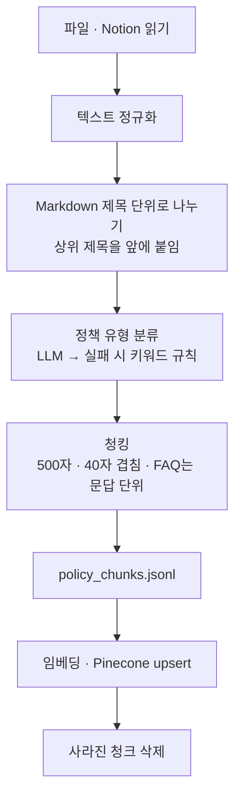

# 학생 챗봇 벡터 DB 적재

[학생 LMS 챗봇](../chatbot/README.md)이 검색하는 문서를 모아 정제·분류·청킹한 뒤 임베딩해서
Pinecone `student` 인덱스에 넣는다. **적재는 이 스크립트를 따로 실행할 때만 한다.** 챗봇이
질문을 받을 때는 이미 만들어 둔 인덱스를 검색만 한다.

| namespace | 원본 | 적재 도구 | 언제 |
|---|---|---|---|
| `policy` | 정책·FAQ·가이드 문서(md·csv·pdf) + Notion 페이지 5개 | `policy_ingestion.py` | 문서가 바뀌었을 때 수동 실행 |
| `project_reference` | 전 기수 프로젝트 목록 CSV | `project_reference_ingestion.py` | 목록이 바뀌었을 때 수동 실행 |
| `notice` | Firestore `cohorts/{기수}/notices` | Cloud Function `syncNoticeVector` ([functions/](../functions/README.md)) | 공지 작성·수정·삭제 즉시 자동 |

## 공통 설정

| 항목 | 값 |
|---|---|
| 인덱스 | `student` (없으면 `policy_ingestion.py`가 serverless aws us-east-1로 만든다) |
| 임베딩 | OpenAI `text-embedding-3-small`, 1536차원, cosine |
| 원문 저장 | 청크 원문을 메타데이터 `page_content`에 같이 넣는다. 챗봇이 검색 결과에서 바로 읽는다 |
| 키 | `OPENAI_API_KEY`, `PINECONE_API_KEY2` (레포 루트 `.env`) |
| 재시도 | 외부 호출은 1·2초 간격으로 최대 3번 |

## 1. 정책·FAQ (`policy`)

### 수집 데이터

`data/policy_*` 폴더의 파일과 Notion 공개 페이지를 읽는다.

| 폴더 | 파일 |
|---|---|
| `data/policy_md/` | 리소스 결제 및 환급절차 매뉴얼, G밸리 캠퍼스 FAQ, SKN 과정 마일리지 제도, 주간회고(WIL) 작성 가이드, 프로그래머스 코딩역량인증 시험 접수 매뉴얼 |
| `data/policy_csv/` | 마일리지 유형 및 한도, 마일리지 지급 체계 |
| `data/policy_pdf/` | 2026 플레이데이터 OT 자료(SK네트웍스 Family AI 캠프 34기) |
| Notion (`NOTION_URLS`) | 플레이데이터 공개 Notion 페이지 5개. `NOTION_TOKEN`이 있을 때만 |

지원 형식은 `.pdf .xlsx .xls .csv .md .txt`다.

### 전처리 흐름



| 단계 | 하는 일 | 이유 |
|---|---|---|
| 읽기 — PDF | PDF를 파일째 LLM에 넘겨 **렌더링된 페이지 이미지 기준으로** 정책 원문만 추출한다. 같은 한글이 3번 이상 반복되는 곳이 5곳 이상이면 실패로 본다 | OT 자료가 PowerPoint형이라 텍스트 레이어의 글꼴 매핑이 깨져 "교교교"처럼 나온다 |
| 읽기 — Notion | 블록을 Markdown으로 바꾼다. `last_edited_time`이 같으면 `.policy_notion_cache.json`의 캐시를 쓴다 | 바뀌지 않은 페이지를 다시 받지 않는다 |
| 읽기 — CSV·텍스트 | `utf-8-sig` → `cp949` 순서로 연다 | 엑셀에서 내보낸 CSV가 섞여 있다 |
| 잡음 제거 | Markdown에서 "선배들이 주는 tip", 전기수 블로그, `blog.naver.com` 줄과 `<aside>` 블록을 뺀다 | 정책이 아닌 개인 후기가 정책처럼 검색되는 것을 막는다 |
| 정규화 | NFKC, 제어문자·기호 제거(단 `+ = < > \| ₩ $ € ¥`는 남김), 공백·빈 줄 정리 | 금액·비교 기호는 정책 내용이다 |
| 제목 단위 분리 | `#` 제목마다 한 구간으로 자르고 상위 제목 경로를 앞에 붙인다 | 청크만 떼어 봐도 어느 정책의 어느 항목인지 알 수 있게 |
| 분류 | 18개 유형 중 하나(마일리지, 출결, 공가, 훈련장려금, 수료 및 제적, FAQ …). LLM이 JSON 스키마 enum으로 답하고, 실패하면 제목·키워드 점수로 정한다. 그래도 모호하면 "생활 및 기타" | 메타데이터 `type`으로 문서 성격을 남긴다 |
| OT PDF 거르기 | OT 자료에서는 훈련 방식·시간표·출결·장려금 등 운영 규정 유형만 남긴다 | 환영 인사·강사 소개·아이스브레이킹은 뺀다 |
| 청킹 | LangChain `RecursiveCharacterTextSplitter`로 **500자, 40자 겹침**(문단 → 줄 → 문장 → 공백 순). FAQ는 `Q.`/`A.` 문답 한 쌍을 먼저 한 덩어리로 자른다 | 정책 한 항목이 짧고, FAQ는 질문과 답이 떨어지면 쓸모가 없다 |

실패한 파일·단계는 멈추지 않고 `policy_ingestion_errors.jsonl`에 남긴 뒤 다음으로 넘어간다.

### 메타데이터

```json
{
  "page_content": "## 출결\n지각·조퇴·외출 3회는 결석 1일로 ...",
  "doc_id": "Attendance_3",
  "type": "Attendance",
  "created_at": "2026-09-05T02:11:40+00:00"
}
```

`doc_id`는 `{유형}_{순번}`이고 벡터 ID로 쓴다.

### 갱신과 삭제

`.policy_ingestion_state.json`에 원본 구간별로 올린 `doc_id`를 기록한다. 다시 올릴 때 이번에 없는 ID는
Pinecone에서 지운다. 인자 없이 전체 파일을 적재하면 파일 원본(csv·excel·file·pdf)에서 나온 예전 ID까지
정리 대상으로 본다.

### 실행

레포 루트에서 실행한다.

```powershell
python -m vectordb.policy_ingestion ingest --dry-run      # JSONL까지만. Pinecone은 건드리지 않음
python -m vectordb.policy_ingestion ingest                # 수집 → 분류 → 청킹 → 적재
python -m vectordb.policy_ingestion ingest vectordb/data/policy_md --source files   # 특정 폴더만
python -m vectordb.policy_ingestion upload --input vectordb/policy_chunks.jsonl     # 만들어 둔 JSONL만 적재
```

| 인자 | 기본값 | 설명 |
|---|---|---|
| `paths` | `data/policy_*` 전체 | 파일 또는 폴더 |
| `--source` | `all` | `files` / `notion` / `all` |
| `--chunk-size` | 500 | 청크 최대 글자 수 |
| `--chunk-overlap` | 40 | 겹치는 글자 수 |
| `--output` | `vectordb/policy_chunks.jsonl` | 청크 결과 파일 |

- `--dry-run`도 PDF 추출과 분류에는 LLM을 부른다. 비용이 없는 것은 임베딩과 Pinecone 쪽뿐이다.
- 분류·PDF 추출 모델은 `OPENAI_MODEL` → `OPENAI_CLASSIFICATION_MODEL` → `OPENAI_PDF_EXTRACTION_MODEL` → `gpt-5.6-luna` 순으로 정한다.

## 2. 전 기수 프로젝트 레퍼런스 (`project_reference`)

### 수집 데이터

`data/project_reference/`의 CSV. 플레이데이터에서 공유한 SK네트웍스 Family AI 캠프 프로젝트 목록이다.

필수 열: `기수`, `구분`, `주제`, `기획설명`, `활용데이터`, `활용기술`, `깃허브 주소`

### 전처리

| 단계 | 규칙 |
|---|---|
| 빈 행 | `주제`가 비면 건너뛴다(건수는 `skipped`로 보고) |
| 차수 | `교과목실습N` → `N`, `최종프로젝트` → `final`. 그 밖의 값은 오류로 멈춘다 |
| GitHub 주소 | `SKNETWORKS-FAMILY-AICAMP/<저장소>`를 찾아 `https://github.com/...`로 맞춘다. 없으면 오류 |
| 팀 번호 | 저장소 이름의 `-Nteam`에서 뽑는다. 없으면 "팀 번호 미상" |
| 청킹 | **하지 않는다.** 프로젝트 하나가 문서 하나다. 여러 프로젝트 내용이 한 청크에 섞이지 않게 |

문서 본문과 메타데이터:

```text
SKN {기수}기 {N차 프로젝트 | 최종 프로젝트} {팀}팀
주제: ...
기획 설명: ...
활용 데이터: ...
활용기술: ...
```

```json
{"doc_id": "{기수}_{차수}_{순번}", "cohort": "{기수}", "project_round": "{N | final}", "github_url": "https://github.com/SKNETWORKS-FAMILY-AICAMP/..."}
```

챗봇은 질문의 "N기", "N차", "최종 프로젝트"를 `cohort`·`project_round` 필터로 바꿔 검색한다.

### 실행

```powershell
python -m vectordb.project_reference_ingestion --dry-run   # project_reference_documents.jsonl까지만
python -m vectordb.project_reference_ingestion             # 적재
```

같은 `doc_id`는 덮어쓴다. 행이 줄어 없어진 `doc_id`를 지우는 기능은 없다.

## 3. 공지 (`notice`) — 자동 동기화

공지는 사람이 적재 명령을 돌리지 않는다. 관리자·강사가 앱에서 공지를 쓰면
`functions/src/noticeVectors.ts`의 Firestore 트리거가 바로 반영한다.

- 정규화와 청킹(500자, 40자 겹침)을 `policy_ingestion.py`와 같은 순서로 TypeScript에 옮겼다.
- 벡터 ID는 `{기수}_{순번}`. 순번 카운터는 `cohorts/{기수}/vectorMetadata/notices`에 있고, 공지마다 쓰는 순번을 `_vectorIndexes` 필드에 적어 둔다.
- 공지가 짧아져 청크가 줄면 남는 벡터를, 공지를 지우면 그 공지의 벡터를 모두 지운다.
- 메타데이터에 `cohort`가 있어 챗봇이 학생 기수로만 검색한다.

## 파일

| 파일 | 역할 |
|---|---|
| `policy_ingestion.py` | 정책·FAQ 수집·분류·청킹·적재 CLI |
| `project_reference_ingestion.py` | 프로젝트 레퍼런스 CSV 적재 CLI |
| `utills.py` | `.env` 읽기, 재시도, 텍스트 정규화, 청킹 |
| `data/` | 원본 문서 |

실행하면 생기는 `policy_chunks.jsonl`, `project_reference_documents.jsonl`, `policy_ingestion_errors.jsonl`,
`.policy_ingestion_state.json`, `.policy_notion_cache.json`은 결과물이다.

## 알려진 한계

- `policy`는 실행할 때마다 모든 청크를 다시 임베딩한다. `content_hash`를 계산해 두지만 바뀌지 않은 청크를 건너뛰는 데는 아직 쓰지 않는다.
- `doc_id`가 유형별 순번이라, 원본 순서가 바뀌면 같은 ID에 다른 청크가 덮어써진다. 결과는 맞지만 ID로 원본을 추적하기 어렵다.
- 이 폴더에는 단위 테스트가 없다. 결과는 `--dry-run`으로 만든 JSONL을 읽어서 확인한다.
